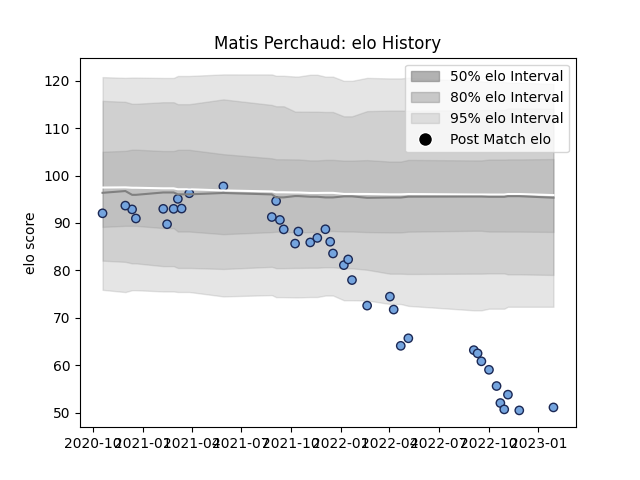

---  
layout: page  
title: Matis Perchaud  
date: 2023-01-30 11:46:04.530747  
categories: player  
---
# Matis Perchaud

## Positions: P

## Current elo: 51.0

## Current Percentile: 0.0

# Elo History

# Match History

| Team    |   Appearances |   Win Rate |
|:--------|--------------:|-----------:|
| Bayonne |            40 |     0.5125 |

| Opponent             |   Matches |   Win Rate |
|:---------------------|----------:|-----------:|
| Agen                 |         3 |   0.833333 |
| Brive                |         3 |   0.666667 |
| Racing 92            |         3 |   0.666667 |
| Beziers              |         2 |   0.5      |
| Vannes               |         2 |   1        |
| Castres Olympique    |         2 |   0        |
| US Bressane          |         2 |   1        |
| Toulon               |         2 |   0.5      |
| Lyon                 |         2 |   0        |
| Mont-de-Marsan       |         2 |   0        |
| Aurillac             |         2 |   1        |
| Montpellier Herault  |         2 |   0        |
| Perpignan            |         1 |   1        |
| Stade Toulousain     |         1 |   1        |
| Stade Francais Paris |         1 |   0        |
| Rouen                |         1 |   1        |
| Montauban            |         1 |   1        |
| Oyonnax              |         1 |   0        |
| Nevers               |         1 |   0.5      |
| Leicester Tigers     |         1 |   0        |
| Grenoble             |         1 |   0        |
| Colomiers            |         1 |   0        |
| Clermont Auvergne    |         1 |   1        |
| Carcassonne          |         1 |   0        |
| Zebre                |         1 |   0.5      |