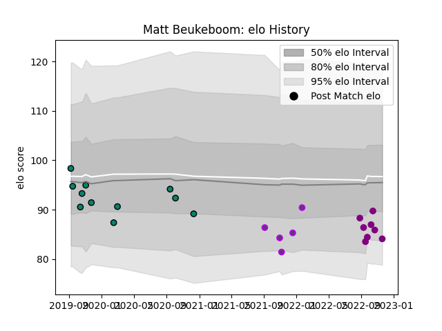

---  
layout: page  
title: Matt Beukeboom  
date: 2022-12-14 11:20:27.424343  
categories: player  
---
# Matt Beukeboom

## Positions: FL, L

## Current elo: 79.0

## Current Percentile: 7.0

# Elo History

# Match History

| Team             |   Appearances |   Win Rate |
|:-----------------|--------------:|-----------:|
| Montauban        |            11 |   0.272727 |
| Soyaux-Angouleme |            10 |   0.3      |
| US Bressane      |             5 |   0.3      |

| Opponent           |   Matches |   Win Rate |
|:-------------------|----------:|-----------:|
| Oyonnax            |         4 |   0        |
| Carcassonne        |         3 |   0.333333 |
| Mont-de-Marsan     |         3 |   0        |
| Vannes             |         3 |   0.666667 |
| Biarritz Olympique |         2 |   0.5      |
| Grenoble           |         2 |   0.5      |
| Provence Rugby     |         2 |   0        |
| Rouen              |         2 |   0        |
| Aurillac           |         1 |   0        |
| Beziers            |         1 |   1        |
| Montauban          |         1 |   0.5      |
| Nevers             |         1 |   0        |
| Roval Drome XV     |         1 |   1        |