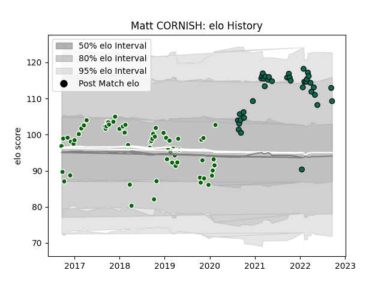

---  
layout: page  
title: Matt CORNISH  
date: 2023-03-12 11:34:32.727131  
categories: player  
---
# Matt CORNISH

## Positions: H

## Current elo: 109.0

## Current Percentile: 87.0

# Elo History

# Match History

| Team                |   Appearances |   Win Rate |
|:--------------------|--------------:|-----------:|
| Ealing Trailfinders |            62 |   0.782258 |
| London Irish        |            37 |   0.351351 |

| Opponent           |   Matches |   Win Rate |
|:-------------------|----------:|-----------:|
| Jersey             |         8 |   1        |
| Bedford            |         7 |   0.857143 |
| Doncaster          |         7 |   0.857143 |
| London Scottish    |         7 |   0.857143 |
| Cornish Pirates    |         5 |   0.6      |
| Northampton Saints |         5 |   0        |
| Leicester Tigers   |         4 |   0        |
| Worcester Warriors |         4 |   0.75     |
| Richmond           |         4 |   0.75     |
| Nottingham         |         4 |   0.75     |
| Yorkshire Carnegie |         4 |   1        |
| Bristol Rugby      |         4 |   0.125    |
| Harlequins         |         3 |   0        |
| Saracens           |         3 |   0.333333 |
| Gloucester Rugby   |         3 |   0.166667 |
| Bath Rugby         |         3 |   0.333333 |
| London Irish       |         3 |   0        |
| Exeter Chiefs      |         3 |   0.666667 |
| Hartpury College   |         3 |   1        |
| Coventry           |         3 |   0.833333 |
| Wasps              |         2 |   0.75     |
| Newcastle Falcons  |         2 |   0.5      |
| Rotherham Titans   |         2 |   1        |
| Sale Sharks        |         2 |   0.25     |
| Edinburgh          |         1 |   1        |
| London Welsh       |         1 |   1        |
| Ampthill           |         1 |   1        |
| Agen               |         1 |   1        |