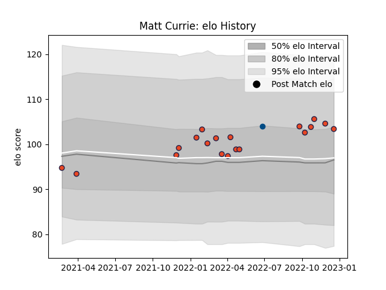

---  
layout: page  
title: Matt Currie  
date: 2022-12-18 16:27:08.809775  
categories: player  
---
# Matt Currie

## Positions: C

## Country: Scotland

## Current elo: 103.0

## Current Percentile: 77.0

# Elo History

# Match History

| Team      |   Appearances |   Win Rate |
|:----------|--------------:|-----------:|
| Edinburgh |            19 |   0.421053 |
| Scotland  |             1 |   1        |

| Opponent          |   Matches |   Win Rate |
|:------------------|----------:|-----------:|
| Benetton Treviso  |         2 |        0.5 |
| Dragons           |         2 |        0.5 |
| Lions             |         2 |        0   |
| Zebre             |         2 |        1   |
| Bulls             |         1 |        0   |
| Cardiff Blues     |         1 |        1   |
| Castres Olympique |         1 |        1   |
| Chile             |         1 |        1   |
| Connacht          |         1 |        1   |
| Glasgow Warriors  |         1 |        0   |
| Leinster          |         1 |        0   |
| London Irish      |         1 |        0   |
| Munster           |         1 |        0   |
| Ospreys           |         1 |        0   |
| Pau               |         1 |        1   |
| Ulster            |         1 |        0   |