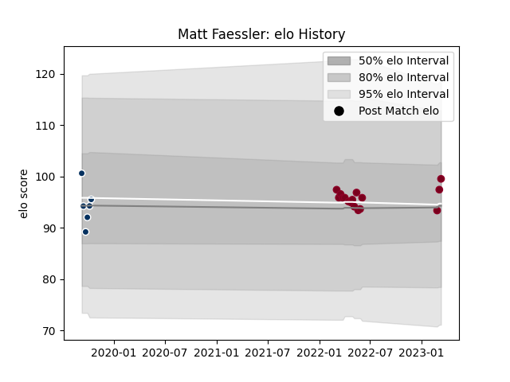

---  
layout: page  
title: Matt Faessler  
date: 2023-03-17 17:36:42.202876  
categories: player  
---
# Matt Faessler

## Positions: H

## Current elo: 100.0

## Current Percentile: 59.0

# Elo History

# Match History

| Team               |   Appearances |   Win Rate |
|:-------------------|--------------:|-----------:|
| Queensland Reds    |            16 |     0.4375 |
| Queensland Country |             6 |     0.5    |

| Opponent                 |   Matches |   Win Rate |
|:-------------------------|----------:|-----------:|
| Brumbies                 |         3 |   0.333333 |
| Crusaders                |         2 |   0        |
| Fijian Drua              |         2 |   0.5      |
| Hurricanes               |         2 |   0        |
| Western Force            |         2 |   1        |
| Blues                    |         1 |   0        |
| Brisbane City            |         1 |   1        |
| Canberra Vikings         |         1 |   1        |
| Chiefs                   |         1 |   0        |
| Highlanders              |         1 |   0        |
| Melbourne Rebels         |         1 |   1        |
| Melbourne Rising         |         1 |   0        |
| Moana Pasifika           |         1 |   1        |
| NSW Country Eagles       |         1 |   1        |
| New South Wales Waratahs |         1 |   1        |
| Sydney Rays              |         1 |   0        |