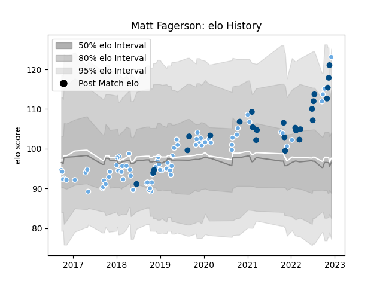

---  
layout: page  
title: Matt Fagerson  
date: 2022-11-16 11:21:27.235334  
categories: player  
---
# Matt Fagerson

## Positions: N8, FL

## Country: Scotland

## Current elo: 118.0

## Current Percentile: 90.0

# Elo History

# Match History

| Team             |   Appearances |   Win Rate |
|:-----------------|--------------:|-----------:|
| Glasgow Warriors |            73 |   0.616438 |
| Scotland         |            25 |   0.52     |

| Opponent                 |   Matches |   Win Rate |
|:-------------------------|----------:|-----------:|
| Edinburgh                |        11 |   0.363636 |
| Zebre                    |         8 |   1        |
| Leinster                 |         7 |   0.285714 |
| Cardiff Blues            |         5 |   1        |
| Ulster                   |         4 |   0.5      |
| Munster                  |         4 |   0.25     |
| Connacht                 |         4 |   0.75     |
| Dragons                  |         4 |   0.625    |
| Italy                    |         3 |   1        |
| Wales                    |         3 |   0        |
| Scarlets                 |         3 |   0.333333 |
| Argentina                |         3 |   0.333333 |
| Benetton Treviso         |         3 |   0.333333 |
| Exeter Chiefs            |         3 |   0.5      |
| Cheetahs                 |         3 |   1        |
| Fiji                     |         2 |   1        |
| Lyon                     |         2 |   1        |
| Southern Kings           |         2 |   1        |
| Saracens                 |         2 |   0        |
| Ospreys                  |         2 |   1        |
| La Rochelle              |         2 |   0.5      |
| England                  |         2 |   1        |
| Australia                |         2 |   0.5      |
| Ireland                  |         2 |   0        |
| Georgia                  |         2 |   1        |
| Lions                    |         1 |   1        |
| Chile                    |         1 |   1        |
| France                   |         1 |   0        |
| Sale Sharks              |         1 |   1        |
| Leicester Tigers         |         1 |   1        |
| South Africa             |         1 |   0        |
| Tonga                    |         1 |   1        |
| Bulls                    |         1 |   1        |
| United States of America |         1 |   0        |
| New Zealand              |         1 |   0        |