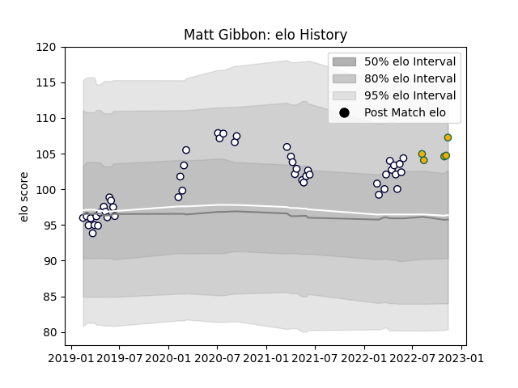

---  
layout: page  
title: Matt Gibbon  
date: 2022-11-15 23:43:51.852770  
categories: player  
---
# Matt Gibbon

## Positions: P

## Country: Australia

## Current elo: 107.0

## Current Percentile: 79.0

# Elo History

# Match History

| Team             |   Appearances |   Win Rate |
|:-----------------|--------------:|-----------:|
| Melbourne Rebels |            48 |   0.385417 |
| Australia        |             5 |   0.4      |

| Opponent                 |   Matches |   Win Rate |
|:-------------------------|----------:|-----------:|
| Queensland Reds          |         7 |   0.357143 |
| New South Wales Waratahs |         7 |   0.571429 |
| Brumbies                 |         5 |   0.4      |
| Western Force            |         4 |   0.5      |
| Highlanders              |         4 |   0.75     |
| Chiefs                   |         3 |   0        |
| Crusaders                |         3 |   0        |
| Hurricanes               |         3 |   0        |
| Lions                    |         2 |   0.5      |
| Sunwolves                |         2 |   1        |
| Sharks                   |         2 |   0        |
| Argentina                |         2 |   0.5      |
| Blues                    |         2 |   0        |
| Moana Pasifika           |         1 |   1        |
| France                   |         1 |   0        |
| Scotland                 |         1 |   1        |
| Fijian Drua              |         1 |   1        |
| Stormers                 |         1 |   0        |
| Bulls                    |         1 |   0        |
| Italy                    |         1 |   0        |