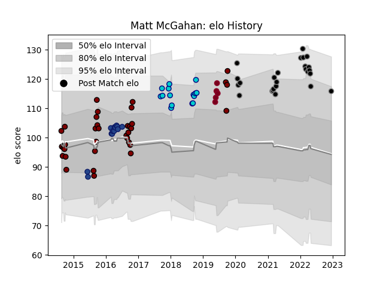

---  
layout: page  
title: Matt McGahan  
date: 2023-03-21 18:30:27.672333  
categories: player  
---
# Matt McGahan

Last updated: 2023-03-21
## Positions: FH, FB

## Current elo: 116.0

## Current Percentile: 87.0

# Elo History

# Match History

| Team               |   Appearances |   Win Rate |
|:-------------------|--------------:|-----------:|
| North Harbour      |            36 |   0.430556 |
| Black Rams Tokyo   |            25 |   0.32     |
| Shizuoka Blue Revs |            15 |   0.733333 |
| Blues              |            13 |   0.423077 |
| Queensland Reds    |             5 |   0.2      |

| Opponent                          |   Matches |   Win Rate |
|:----------------------------------|----------:|-----------:|
| Otago                             |         5 |   0.2      |
| Wellington                        |         5 |   0.4      |
| Yokohama Canon Eagles             |         4 |   0.5      |
| Manawatu                          |         4 |   0.75     |
| Saitama Wild Knights              |         4 |   0        |
| Canterbury                        |         3 |   0.333333 |
| Shizuoka Blue Revs                |         3 |   0.333333 |
| Northland                         |         3 |   0.666667 |
| Southland                         |         3 |   0.666667 |
| Tasman                            |         3 |   0.166667 |
| Bay of Plenty                     |         3 |   0.333333 |
| Tokyo Sungoliath                  |         3 |   0        |
| Toshiba Brave Lupus Tokyo         |         3 |   0.666667 |
| Kobelco Kobe Steelers             |         3 |   0        |
| Toyota Verblitz                   |         3 |   0.333333 |
| Green Rockets Tokatsu             |         3 |   1        |
| Hurricanes                        |         2 |   0        |
| Urayasu D-Rocks                   |         2 |   0        |
| Chiefs                            |         2 |   0        |
| Highlanders                       |         2 |   0.5      |
| Waikato                           |         2 |   0        |
| Hawke's Bay                       |         2 |   0.5      |
| Crusaders                         |         2 |   0        |
| Munakata Sanix Blues              |         2 |   1        |
| NTT Docomo Red Hurricanes Osaka   |         2 |   0.5      |
| Counties Manukau                  |         2 |   1        |
| Coca-Cola Red Sparks              |         2 |   1        |
| Black Rams Tokyo                  |         2 |   1        |
| Jaguares                          |         2 |   0.5      |
| Southern Kings                    |         1 |   1        |
| Auckland                          |         1 |   0        |
| Sharks                            |         1 |   1        |
| Queensland Reds                   |         1 |   0.5      |
| New South Wales Waratahs          |         1 |   0        |
| Mitsubishi Dynaboars              |         1 |   0        |
| Melbourne Rebels                  |         1 |   1        |
| Lions                             |         1 |   0        |
| Kubota Spears Funabashi Tokyo-Bay |         1 |   1        |
| Hino Red Dolphins                 |         1 |   1        |
| Brumbies                          |         1 |   0        |
| Blues                             |         1 |   1        |
| Mie Honda Heat                    |         1 |   1        |