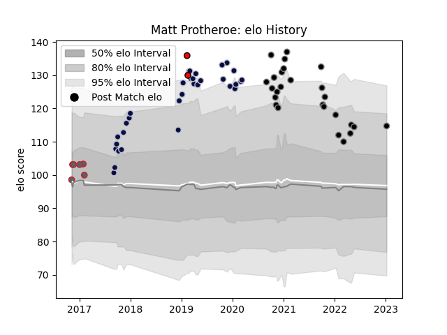

---  
layout: page  
title: Matt Protheroe  
date: 2023-01-13 11:28:45.757494  
categories: player  
---
# Matt Protheroe

## Positions: FB, W

## Current elo: 115.0

## Current Percentile: 84.0

# Elo History

# Match History

| Team             |   Appearances |   Win Rate |
|:-----------------|--------------:|-----------:|
| Bristol Rugby    |            32 |   0.796875 |
| Ospreys          |            26 |   0.653846 |
| Gloucester Rugby |             6 |   0.583333 |
| Hartpury College |             2 |   0.5      |

| Opponent             |   Matches |   Win Rate |
|:---------------------|----------:|-----------:|
| Zebre                |         4 |   0.625    |
| Cardiff Blues        |         4 |   0.75     |
| Dragons              |         3 |   1        |
| Richmond             |         3 |   1        |
| Northampton Saints   |         3 |   0.333333 |
| La Rochelle          |         3 |   0.333333 |
| Harlequins           |         3 |   0.333333 |
| Bath Rugby           |         3 |   0.833333 |
| Cornish Pirates      |         2 |   1        |
| Glasgow Warriors     |         2 |   0.5      |
| Leinster             |         2 |   0        |
| Benetton Treviso     |         2 |   1        |
| Saracens             |         2 |   1        |
| Brive                |         2 |   1        |
| Gloucester Rugby     |         2 |   1        |
| Edinburgh            |         2 |   1        |
| Worcester Warriors   |         2 |   0.5      |
| Munster              |         2 |   0.5      |
| Stade Francais Paris |         1 |   1        |
| Sharks               |         1 |   0        |
| Scarlets             |         1 |   1        |
| Ulster               |         1 |   0        |
| Rotherham Titans     |         1 |   1        |
| Wasps                |         1 |   1        |
| RC Enisei            |         1 |   1        |
| London Scottish      |         1 |   1        |
| Newcastle Falcons    |         1 |   1        |
| Coventry             |         1 |   0        |
| Leicester Tigers     |         1 |   1        |
| Bulls                |         1 |   0        |
| Bedford              |         1 |   1        |
| Hartpury College     |         1 |   1        |
| Castres Olympique    |         1 |   1        |
| Exeter Chiefs        |         1 |   0        |
| Ealing Trailfinders  |         1 |   1        |
| Connacht             |         1 |   1        |
| Doncaster            |         1 |   1        |
| Jersey               |         1 |   1        |