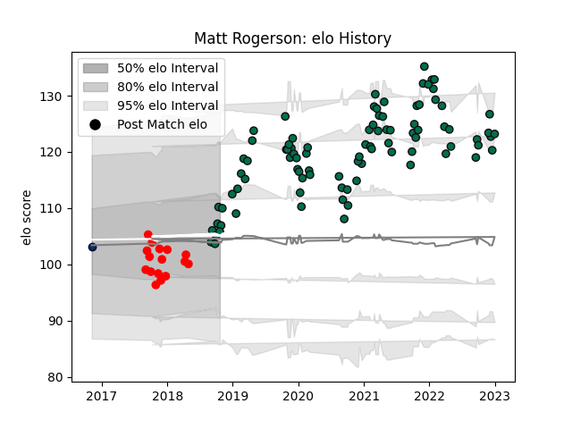

---  
layout: page  
title: Matt Rogerson  
date: 2022-12-09 13:07:09.964034  
categories: player  
---
# Matt Rogerson

## Positions: FL, N8

## Current elo: 118.0

## Current Percentile: 93.0

# Elo History

# Match History

| Team         |   Appearances |   Win Rate |
|:-------------|--------------:|-----------:|
| London Irish |            85 |   0.464706 |
| Jersey       |            15 |   0.566667 |
| Sale Sharks  |             1 |   1        |

| Opponent            |   Matches |   Win Rate |
|:--------------------|----------:|-----------:|
| Wasps               |         7 |   0.5      |
| Leicester Tigers    |         6 |   0.333333 |
| Bristol Rugby       |         6 |   0.166667 |
| Exeter Chiefs       |         6 |   0.5      |
| Gloucester Rugby    |         6 |   0.416667 |
| Newcastle Falcons   |         5 |   0.8      |
| Worcester Warriors  |         5 |   0.2      |
| Sale Sharks         |         5 |   0.1      |
| Northampton Saints  |         5 |   0.2      |
| Harlequins          |         5 |   0.5      |
| Saracens            |         4 |   0.125    |
| Nottingham          |         4 |   0.875    |
| Bath Rugby          |         4 |   0.5      |
| Yorkshire Carnegie  |         4 |   0.25     |
| London Scottish     |         3 |   1        |
| Hartpury College    |         3 |   1        |
| Doncaster           |         3 |   0.666667 |
| Cornish Pirates     |         3 |   1        |
| Jersey              |         2 |   0.5      |
| Bayonne             |         2 |   0.5      |
| Ealing Trailfinders |         2 |   1        |
| Richmond            |         2 |   0.5      |
| Scarlets            |         2 |   0        |
| Bedford             |         2 |   0.5      |
| Edinburgh           |         1 |   1        |
| Pau                 |         1 |   1        |
| Rotherham Titans    |         1 |   1        |
| Coventry            |         1 |   1        |
| Toulon              |         1 |   0        |