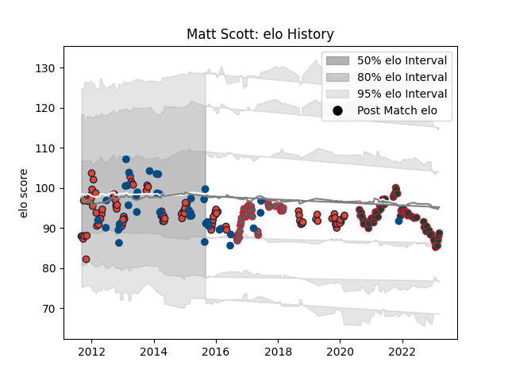

---  
layout: page  
title: Matt Scott  
date: 2023-01-06 11:43:10.914175  
categories: player  
---
# Matt Scott

## Positions: C

## Country: Scotland

## Current elo: 100.0

## Current Percentile: 30.0

# Elo History

# Match History

| Team             |   Appearances |   Win Rate |
|:-----------------|--------------:|-----------:|
| Edinburgh        |            94 |   0.489362 |
| Leicester Tigers |            50 |   0.62     |
| Scotland         |            39 |   0.435897 |
| Gloucester Rugby |            35 |   0.442857 |

| Opponent                 |   Matches |   Win Rate |
|:-------------------------|----------:|-----------:|
| Benetton Treviso         |        12 |   0.666667 |
| London Irish             |        10 |   0.9      |
| Glasgow Warriors         |        10 |   0.45     |
| Connacht                 |        10 |   0.7      |
| Italy                    |         8 |   0.875    |
| Exeter Chiefs            |         8 |   0.3125   |
| Munster                  |         8 |   0.375    |
| Harlequins               |         8 |   0.25     |
| Worcester Warriors       |         7 |   0.785714 |
| Wasps                    |         6 |   0.583333 |
| Bath Rugby               |         6 |   0.5      |
| Ulster                   |         6 |   0        |
| Scarlets                 |         6 |   0.666667 |
| Saracens                 |         6 |   0.333333 |
| Cardiff Blues            |         6 |   0.333333 |
| Dragons                  |         6 |   0.666667 |
| Sale Sharks              |         6 |   0.333333 |
| Newcastle Falcons        |         6 |   0.5      |
| Leinster                 |         6 |   0.166667 |
| Northampton Saints       |         5 |   0.4      |
| Zebre                    |         5 |   0.6      |
| Ireland                  |         5 |   0.2      |
| Japan                    |         4 |   1        |
| Bordeaux Begles          |         4 |   0.625    |
| South Africa             |         4 |   0        |
| England                  |         4 |   0        |
| Leicester Tigers         |         4 |   0.25     |
| Ospreys                  |         3 |   0.666667 |
| Wales                    |         3 |   0        |
| France                   |         3 |   0        |
| Samoa                    |         3 |   0.666667 |
| Racing 92                |         3 |   0.666667 |
| Grenoble                 |         2 |   0.5      |
| Toulon                   |         2 |   0.5      |
| London Welsh             |         2 |   1        |
| La Rochelle              |         2 |   0.5      |
| Bristol Rugby            |         2 |   0.5      |
| Gloucester Rugby         |         2 |   1        |
| Bayonne                  |         2 |   1        |
| Stade Toulousain         |         1 |   1        |
| United States of America |         1 |   1        |
| Australia                |         1 |   1        |
| Tonga                    |         1 |   0        |
| Aironi                   |         1 |   0        |
| Stade Francais Paris     |         1 |   0        |
| Southern Kings           |         1 |   1        |
| Brive                    |         1 |   1        |
| Fiji                     |         1 |   1        |
| New Zealand              |         1 |   0        |
| Montpellier Herault      |         1 |   0        |
| Lyon                     |         1 |   0        |
| Agen                     |         1 |   1        |