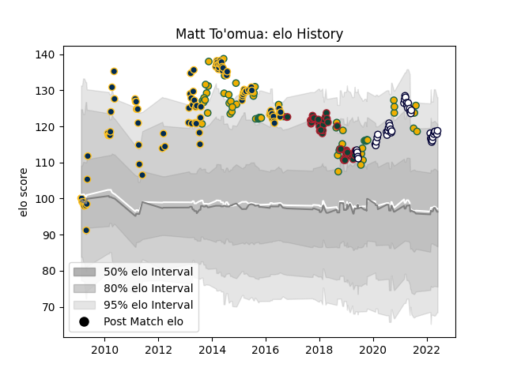

---  
layout: page  
title: Matt To'omua  
date: 2023-03-21 18:18:48.893088  
categories: player  
---
# Matt To'omua

Last updated: 2023-03-21
## Positions: FH, C

## Country: Australia

## Current elo: 119.0

## Current Percentile: 87.0

# Elo History

# Match History

| Team             |   Appearances |   Win Rate |
|:-----------------|--------------:|-----------:|
| Brumbies         |            93 |   0.586022 |
| Australia        |            62 |   0.483871 |
| Melbourne Rebels |            42 |   0.345238 |
| Leicester Tigers |            41 |   0.390244 |

| Opponent                 |   Matches |   Win Rate |
|:-------------------------|----------:|-----------:|
| New Zealand              |        19 |   0.157895 |
| Western Force            |        17 |   0.705882 |
| New South Wales Waratahs |        16 |   0.5625   |
| Queensland Reds          |        16 |   0.4375   |
| Chiefs                   |        10 |   0.4      |
| Argentina                |         9 |   0.777778 |
| Crusaders                |         9 |   0.111111 |
| Highlanders              |         9 |   0.555556 |
| Hurricanes               |         8 |   0.5      |
| South Africa             |         8 |   0.375    |
| Blues                    |         7 |   0.428571 |
| Cheetahs                 |         6 |   0.833333 |
| Stormers                 |         6 |   0.5      |
| France                   |         6 |   0.833333 |
| Bulls                    |         6 |   0.5      |
| Brumbies                 |         6 |   0.166667 |
| Melbourne Rebels         |         6 |   0.666667 |
| England                  |         6 |   0.166667 |
| Sharks                   |         5 |   0.6      |
| Racing 92                |         5 |   0.2      |
| Lions                    |         4 |   0.75     |
| Harlequins               |         4 |   0.75     |
| Exeter Chiefs            |         4 |   0.25     |
| Saracens                 |         3 |   0.333333 |
| Bath Rugby               |         3 |   0.333333 |
| Wales                    |         3 |   0.333333 |
| Gloucester Rugby         |         3 |   0.666667 |
| Northampton Saints       |         3 |   0        |
| Scarlets                 |         2 |   0.5      |
| Bristol Rugby            |         2 |   0        |
| Uruguay                  |         2 |   1        |
| Ulster                   |         2 |   0        |
| Sunwolves                |         2 |   0.5      |
| Fiji                     |         2 |   1        |
| Ireland                  |         2 |   0.5      |
| Italy                    |         2 |   1        |
| Fijian Drua              |         2 |   0.5      |
| Newcastle Falcons        |         2 |   0.5      |
| London Irish             |         2 |   1        |
| Worcester Warriors       |         2 |   0.5      |
| Scotland                 |         1 |   1        |
| Samoa                    |         1 |   1        |
| Castres Olympique        |         1 |   1        |
| Georgia                  |         1 |   1        |
| Glasgow Warriors         |         1 |   0        |
| Munster                  |         1 |   0        |
| Wasps                    |         1 |   1        |