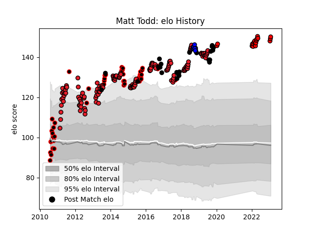

---  
layout: page  
title: Matt Todd  
date: 2023-01-15 12:03:51.056251  
categories: player  
---
# Matt Todd

## Positions: FL

## Country: New Zealand

## Current elo: 148.0

## Current Percentile: 99.0

# Elo History

# Match History

| Team                      |   Appearances |   Win Rate |
|:--------------------------|--------------:|-----------:|
| Crusaders                 |           141 |   0.737589 |
| Canterbury                |            46 |   0.793478 |
| New Zealand               |            26 |   0.903846 |
| Toshiba Brave Lupus Tokyo |            16 |   0.6875   |
| Saitama Wild Knights      |             7 |   0.857143 |

| Opponent                          |   Matches |   Win Rate |
|:----------------------------------|----------:|-----------:|
| Hurricanes                        |        18 |   0.555556 |
| Highlanders                       |        17 |   0.705882 |
| Chiefs                            |        16 |   0.5      |
| Blues                             |        15 |   0.8      |
| New South Wales Waratahs          |         9 |   0.666667 |
| Sharks                            |         8 |   0.8125   |
| Queensland Reds                   |         7 |   0.714286 |
| Tasman                            |         7 |   0.428571 |
| Brumbies                          |         7 |   1        |
| Bulls                             |         7 |   0.714286 |
| Stormers                          |         7 |   0.928571 |
| Lions                             |         7 |   0.857143 |
| Melbourne Rebels                  |         6 |   0.833333 |
| Otago                             |         5 |   1        |
| Cheetahs                          |         5 |   0.8      |
| Waikato                           |         5 |   0.8      |
| Taranaki                          |         5 |   0.6      |
| South Africa                      |         5 |   0.9      |
| Australia                         |         5 |   0.8      |
| France                            |         4 |   1        |
| Auckland                          |         4 |   1        |
| Wellington                        |         4 |   0.75     |
| Western Force                     |         4 |   1        |
| Tokyo Sungoliath                  |         3 |   0.666667 |
| Northland                         |         3 |   1        |
| Counties Manukau                  |         3 |   1        |
| Shizuoka Blue Revs                |         3 |   1        |
| Jaguares                          |         3 |   1        |
| Sunwolves                         |         2 |   1        |
| North Harbour                     |         2 |   1        |
| Yokohama Canon Eagles             |         2 |   1        |
| Mie Honda Heat                    |         2 |   1        |
| Manawatu                          |         2 |   1        |
| Kubota Spears Funabashi Tokyo-Bay |         2 |   0.5      |
| Southland                         |         2 |   0.5      |
| Ireland                           |         2 |   0.5      |
| Hawke's Bay                       |         2 |   0.75     |
| Toyota Verblitz                   |         2 |   0.5      |
| Wales                             |         2 |   1        |
| Black Rams Tokyo                  |         2 |   0.5      |
| Bay of Plenty                     |         2 |   1        |
| Southern Kings                    |         2 |   1        |
| Tonga                             |         1 |   1        |
| Toshiba Brave Lupus Tokyo         |         1 |   1        |
| Argentina                         |         1 |   1        |
| Scotland                          |         1 |   1        |
| Samoa                             |         1 |   1        |
| Saitama Wild Knights              |         1 |   0        |
| Namibia                           |         1 |   1        |
| NTT Docomo Red Hurricanes Osaka   |         1 |   1        |
| Kobelco Kobe Steelers             |         1 |   1        |
| Italy                             |         1 |   1        |
| Green Rockets Tokatsu             |         1 |   1        |
| England                           |         1 |   1        |
| Coca-Cola Red Sparks              |         1 |   1        |
| Canada                            |         1 |   1        |
| British and Irish Lions           |         1 |   0        |
| Mitsubishi Dynaboars              |         1 |   0        |