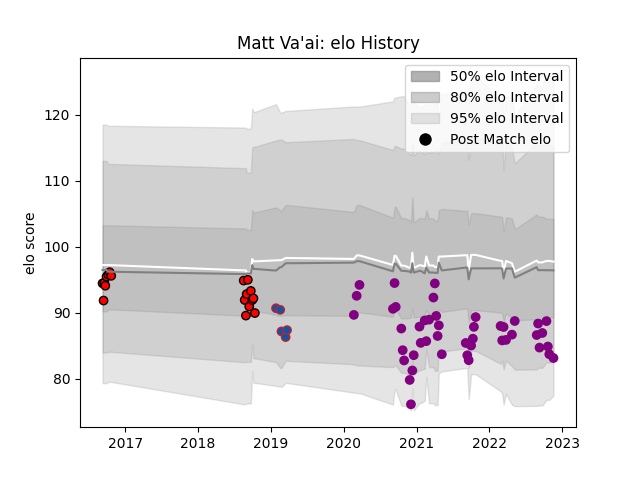

---  
layout: page  
title: Matt Va'ai  
date: 2022-11-22 11:27:45.824757  
categories: player  
---
# Matt Va'ai

## Positions: N8, L

## Current elo: 83.0

## Current Percentile: 14.0

# Elo History

# Match History

| Team             |   Appearances |   Win Rate |
|:-----------------|--------------:|-----------:|
| Soyaux-Angouleme |            45 |   0.388889 |
| Counties Manukau |            18 |   0.333333 |
| Grenoble         |             5 |   0        |

| Opponent                   |   Matches |   Win Rate |
|:---------------------------|----------:|-----------:|
| Aurillac                   |         3 |   0.333333 |
| Vannes                     |         3 |   0.666667 |
| Rouen                      |         3 |   0.333333 |
| Canterbury                 |         3 |   0.333333 |
| Perpignan                  |         3 |   0        |
| Colomiers                  |         3 |   0.333333 |
| Nevers                     |         3 |   0.166667 |
| Montauban                  |         2 |   0        |
| Grenoble                   |         2 |   0        |
| Valence Romans Drome Rugby |         2 |   0.5      |
| Tasman                     |         2 |   0        |
| Taranaki                   |         2 |   0        |
| Provence Rugby             |         2 |   0.5      |
| Oyonnax                    |         2 |   0        |
| Auckland                   |         2 |   0.5      |
| Wellington                 |         2 |   0        |
| Carcassonne                |         2 |   0.5      |
| Beziers                    |         2 |   1        |
| Dax                        |         2 |   0.5      |
| Chambery                   |         2 |   0        |
| Bourgoin-Jallieu           |         1 |   1        |
| Waikato                    |         1 |   1        |
| Bay of Plenty              |         1 |   0        |
| Biarritz Olympique         |         1 |   0        |
| Tarbes                     |         1 |   0        |
| Bordeaux Begles            |         1 |   0        |
| Suresnes                   |         1 |   1        |
| Stade Toulousain           |         1 |   0        |
| Southland                  |         1 |   1        |
| Hawke's Bay                |         1 |   1        |
| Racing 92                  |         1 |   0        |
| La Rochelle                |         1 |   0        |
| Cognac Saint Jean d'Angély |         1 |   1        |
| Otago                      |         1 |   1        |
| Northland                  |         1 |   0        |
| North Harbour              |         1 |   0        |
| Nice                       |         1 |   1        |
| Dijon                      |         1 |   0        |
| Mont-de-Marsan             |         1 |   1        |
| Massy                      |         1 |   0        |
| Aubenas                    |         1 |   1        |