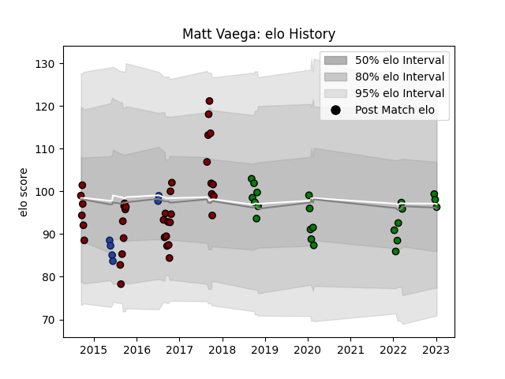

---  
layout: page  
title: Matt Vaega  
date: 2023-02-02 19:13:53.713332  
categories: player  
---
# Matt Vaega

## Positions: C

## Current elo: 95.0

## Current Percentile: 49.0

# Elo History

# Match History

| Team                 |   Appearances |   Win Rate |
|:---------------------|--------------:|-----------:|
| North Harbour        |            37 |   0.527027 |
| Mitsubishi Dynaboars |            25 |   0.62     |
| Blues                |             6 |   0.333333 |

| Opponent                        |   Matches |   Win Rate |
|:--------------------------------|----------:|-----------:|
| Canterbury                      |         5 |   0.2      |
| Wellington                      |         4 |   0.25     |
| Manawatu                        |         3 |   0.666667 |
| Tasman                          |         3 |   0.166667 |
| Counties Manukau                |         3 |   1        |
| Southland                       |         3 |   1        |
| Hanazono Kintetsu Liners        |         3 |   0.666667 |
| Hawke's Bay                     |         3 |   0.666667 |
| Otago                           |         3 |   0.333333 |
| Northland                       |         3 |   0.666667 |
| Bay of Plenty                   |         2 |   0.5      |
| Waikato                         |         2 |   0.5      |
| Toshiba Brave Lupus Tokyo       |         2 |   0.5      |
| Shizuoka Blue Revs              |         2 |   0.25     |
| Saitama Wild Knights            |         2 |   0        |
| NTT Docomo Red Hurricanes Osaka |         2 |   0        |
| Auckland                        |         2 |   0.5      |
| Kamaishi Seawaves               |         2 |   1        |
| Hurricanes                      |         2 |   0        |
| Kyuden Voltex                   |         1 |   1        |
| Taranaki                        |         1 |   1        |
| Black Rams Tokyo                |         1 |   1        |
| Brumbies                        |         1 |   1        |
| Toyota Verblitz                 |         1 |   1        |
| Bulls                           |         1 |   1        |
| Tokyo Sungoliath                |         1 |   0        |
| Chugoku Red Regulions           |         1 |   1        |
| Skyactivs Hiroshima             |         1 |   1        |
| Crusaders                       |         1 |   0        |
| Kurita Water Gush               |         1 |   1        |
| Green Rockets Tokatsu           |         1 |   1        |
| Highlanders                     |         1 |   0        |
| Hino Red Dolphins               |         1 |   1        |
| Mie Honda Heat                  |         1 |   1        |
| Mazda Blue Zoomers              |         1 |   1        |
| Yokohama Canon Eagles           |         1 |   0        |