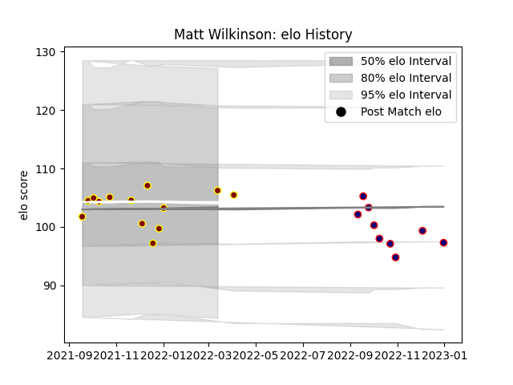

---  
layout: page  
title: Matt Wilkinson  
date: 2023-02-02 19:04:22.901541  
categories: player  
---
# Matt Wilkinson

## Positions: L

## Current elo: 100.0

## Current Percentile: 64.0

# Elo History

# Match History

| Team            |   Appearances |   Win Rate |
|:----------------|--------------:|-----------:|
| Ampthill        |            13 |  0.461538  |
| London Scottish |            13 |  0.0769231 |

| Opponent            |   Matches |   Win Rate |
|:--------------------|----------:|-----------:|
| Bedford             |         3 |   0        |
| Cornish Pirates     |         3 |   0.166667 |
| Coventry            |         3 |   0.333333 |
| Ealing Trailfinders |         3 |   0        |
| Jersey              |         3 |   0.166667 |
| Nottingham          |         3 |   0.333333 |
| Ampthill            |         2 |   0        |
| London Scottish     |         2 |   1        |
| Richmond            |         2 |   0.5      |
| Caldy               |         1 |   1        |
| Hartpury College    |         1 |   0        |