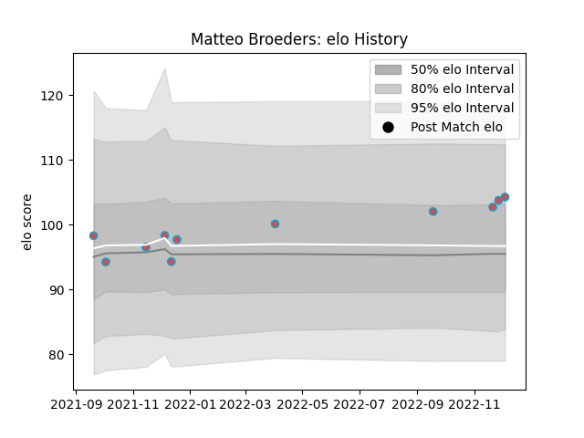

---  
layout: page  
title: Matteo Broeders  
date: 2022-12-09 13:09:38.455411  
categories: player  
---
# Matteo Broeders

## Positions: FL, L

## Current elo: 104.0

## Current Percentile: 71.0

# Elo History

# Match History

| Team             |   Appearances |   Win Rate |
|:-----------------|--------------:|-----------:|
| Bourgoin-Jallieu |            11 |   0.272727 |

| Opponent                   |   Matches |   Win Rate |
|:---------------------------|----------:|-----------:|
| Blagnac                    |         2 |          0 |
| Albi                       |         1 |          0 |
| Chambery                   |         1 |          1 |
| Cognac Saint Jean d'Angély |         1 |          1 |
| Dijon                      |         1 |          0 |
| Massy                      |         1 |          0 |
| Nice                       |         1 |          1 |
| Soyaux-Angouleme           |         1 |          0 |
| Suresnes                   |         1 |          0 |
| Valence Romans Drome Rugby |         1 |          0 |