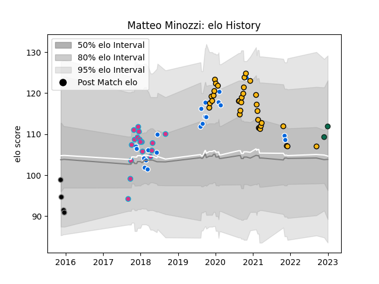

---  
layout: page  
title: Matteo Minozzi  
date: 2023-01-06 00:21:22.839395  
categories: player  
---
# Matteo Minozzi

## Positions: FB, W

## Country: Italy

## Current elo: 112.0

## Current Percentile: 69.0

# Elo History

# Match History

| Team             |   Appearances |   Win Rate |
|:-----------------|--------------:|-----------:|
| Wasps            |            33 |   0.424242 |
| Italy            |            22 |   0.227273 |
| Zebre            |            17 |   0.411765 |
| Calvisano        |             4 |   0        |
| Benetton Treviso |             2 |   1        |

| Opponent            |   Matches |   Win Rate |
|:--------------------|----------:|-----------:|
| Gloucester Rugby    |         5 |   0        |
| Harlequins          |         5 |   0.2      |
| Bristol Rugby       |         4 |   0.75     |
| Worcester Warriors  |         4 |   0.75     |
| France              |         3 |   0        |
| Northampton Saints  |         3 |   0.333333 |
| Benetton Treviso    |         3 |   0.333333 |
| Sale Sharks         |         3 |   0        |
| Edinburgh           |         3 |   0.333333 |
| Exeter Chiefs       |         3 |   0.333333 |
| Japan               |         2 |   0.5      |
| Newcastle Falcons   |         2 |   0.5      |
| Scotland            |         2 |   0        |
| South Africa        |         2 |   0        |
| Argentina           |         2 |   0        |
| Leicester Tigers    |         2 |   0.5      |
| Agen                |         2 |   1        |
| Ireland             |         2 |   0        |
| Southern Kings      |         2 |   1        |
| England             |         2 |   0        |
| Wales               |         2 |   0        |
| Cardiff Blues       |         2 |   0        |
| Bath Rugby          |         2 |   1        |
| Ospreys             |         2 |   0.5      |
| Russia              |         1 |   1        |
| Ulster              |         1 |   1        |
| Saracens            |         1 |   0        |
| Leinster            |         1 |   0        |
| Pau                 |         1 |   0        |
| New Zealand         |         1 |   0        |
| Namibia             |         1 |   1        |
| Montpellier Herault |         1 |   0        |
| London Irish        |         1 |   0        |
| Fiji                |         1 |   1        |
| Connacht            |         1 |   1        |
| Cheetahs            |         1 |   0        |
| Canada              |         1 |   1        |
| Zebre               |         1 |   1        |