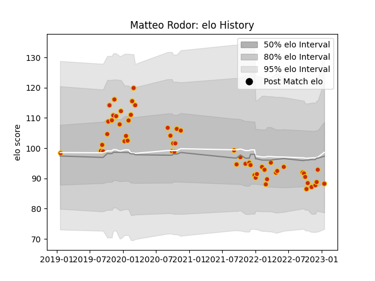

---  
layout: page  
title: Matteo Rodor  
date: 2022-12-14 11:32:20.926377  
categories: player  
---
# Matteo Rodor

## Positions: FH, SH

## Current elo: 92.0

## Current Percentile: 40.0

# Elo History

# Match History

| Team      |   Appearances |   Win Rate |
|:----------|--------------:|-----------:|
| Perpignan |            47 |   0.489362 |

| Opponent             |   Matches |   Win Rate |
|:---------------------|----------:|-----------:|
| Montauban            |         3 |   1        |
| Biarritz Olympique   |         3 |   0.666667 |
| Stade Toulousain     |         3 |   0.333333 |
| Carcassonne          |         3 |   0.666667 |
| Racing 92            |         3 |   0.333333 |
| Clermont Auvergne    |         3 |   0.333333 |
| La Rochelle          |         2 |   0        |
| Stade Francais Paris |         2 |   0        |
| Soyaux-Angouleme     |         2 |   1        |
| Aurillac             |         2 |   1        |
| Grenoble             |         2 |   0.5      |
| Castres Olympique    |         2 |   0.5      |
| Brive                |         2 |   0.5      |
| Bordeaux Begles      |         2 |   1        |
| Toulon               |         2 |   0.5      |
| Lyon                 |         1 |   0        |
| Mont-de-Marsan       |         1 |   1        |
| Beziers              |         1 |   0        |
| Montpellier Herault  |         1 |   0        |
| Nevers               |         1 |   0        |
| Oyonnax              |         1 |   0        |
| Pau                  |         1 |   0        |
| Rouen                |         1 |   1        |
| Roval Drome XV       |         1 |   1        |
| Sale Sharks          |         1 |   0        |
| Bristol Rugby        |         1 |   0        |