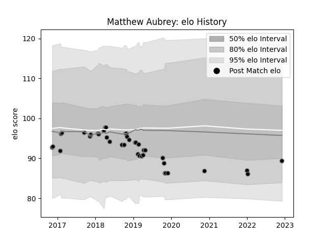

---  
layout: page  
title: Matthew Aubrey  
date: 2022-12-12 15:31:56.928263  
categories: player  
---
# Matthew Aubrey

## Positions: SH

## Current elo: 89.0

## Current Percentile: None

# Elo History

# Match History

| Team    |   Appearances |   Win Rate |
|:--------|--------------:|-----------:|
| Ospreys |            39 |   0.333333 |

| Opponent           |   Matches |   Win Rate |
|:-------------------|----------:|-----------:|
| Munster            |         5 |        0   |
| Connacht           |         4 |        0.5 |
| Cardiff Blues      |         3 |        1   |
| Ulster             |         3 |        0   |
| Glasgow Warriors   |         3 |        0   |
| Leinster           |         2 |        0.5 |
| Wasps              |         2 |        0.5 |
| Southern Kings     |         2 |        0.5 |
| Scarlets           |         2 |        0   |
| Zebre              |         2 |        0.5 |
| Cheetahs           |         2 |        0.5 |
| Benetton Treviso   |         1 |        1   |
| Harlequins         |         1 |        0   |
| Pau                |         1 |        0   |
| Gloucester Rugby   |         1 |        0   |
| Sharks             |         1 |        0   |
| Dragons            |         1 |        1   |
| Bristol Rugby      |         1 |        1   |
| Worcester Warriors |         1 |        0   |
| Bath Rugby         |         1 |        0   |