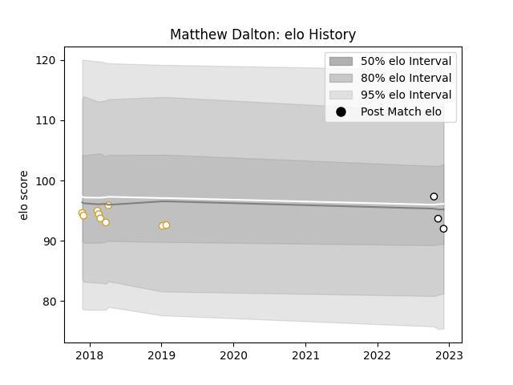

---  
layout: page  
title: Matthew Dalton  
date: 2022-12-14 11:20:22.504767  
categories: player  
---
# Matthew Dalton

## Positions: L, FL

## Current elo: 90.0

## Current Percentile: 42.0

# Elo History

# Match History

| Team              |   Appearances |   Win Rate |
|:------------------|--------------:|-----------:|
| Ulster            |             9 |   0.444444 |
| Newcastle Falcons |             4 |   0        |

| Opponent           |   Matches |   Win Rate |
|:-------------------|----------:|-----------:|
| Benetton Treviso   |         2 |       0.75 |
| Edinburgh          |         2 |       0.5  |
| Bath Rugby         |         1 |       0    |
| Cardiff Blues      |         1 |       0    |
| Connacht           |         1 |       0    |
| Dragons            |         1 |       0.5  |
| Leinster           |         1 |       0    |
| London Irish       |         1 |       0    |
| Northampton Saints |         1 |       0    |
| Scarlets           |         1 |       0    |
| Southern Kings     |         1 |       1    |