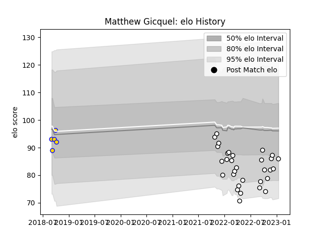

---  
layout: page  
title: Matthew Gicquel  
date: 2022-12-09 13:03:56.521785  
categories: player  
---
# Matthew Gicquel

## Positions: FL, N8

## Current elo: 86.0

## Current Percentile: 13.0

# Elo History

# Match History

| Team                       |   Appearances |   Win Rate |
|:---------------------------|--------------:|-----------:|
| Valence Romans Drome Rugby |            18 |   0.555556 |
| Brisbane City              |             3 |   0.666667 |

| Opponent                   |   Matches |   Win Rate |
|:---------------------------|----------:|-----------:|
| Blagnac                    |         2 |        0.5 |
| Cognac Saint Jean d'Angély |         2 |        1   |
| Dijon                      |         2 |        0.5 |
| Massy                      |         2 |        0   |
| Tarbes                     |         2 |        0.5 |
| Carqueiranne-Hyères        |         1 |        1   |
| Dax                        |         1 |        0   |
| Fijian Drua                |         1 |        0   |
| NSW Country Eagles         |         1 |        1   |
| Narbonne                   |         1 |        1   |
| Nice                       |         1 |        1   |
| Queensland Country         |         1 |        1   |
| Rennes                     |         1 |        1   |
| Soyaux-Angouleme           |         1 |        0   |
| Suresnes                   |         1 |        1   |
| US Bressane                |         1 |        0   |