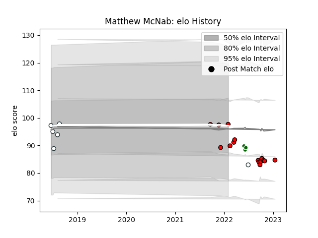

---  
layout: page  
title: Matthew McNab  
date: 2023-03-21 18:33:44.303067  
categories: player  
---
# Matthew McNab

Last updated: 2023-03-21
## Positions: W, C

## Country: Zimbabwe

## Current elo: 98.0

## Current Percentile: 38.0

# Elo History

# Match History

| Team              |   Appearances |   Win Rate |
|:------------------|--------------:|-----------:|
| Hartpury College  |            19 |   0.368421 |
| Zimbabwe          |             6 |   0.416667 |
| Zimbabwe Goshawks |             3 |   0        |

| Opponent               |   Matches |   Win Rate |
|:-----------------------|----------:|-----------:|
| Richmond               |         4 |   0.5      |
| Bedford                |         3 |   0.333333 |
| Doncaster              |         3 |   0.333333 |
| Jersey                 |         3 |   0        |
| Ealing Trailfinders    |         2 |   0        |
| Nottingham             |         2 |   1        |
| Namibia                |         1 |   0        |
| Uganda                 |         1 |   1        |
| Tunisia                |         1 |   0        |
| Netherlands            |         1 |   1        |
| Leopards               |         1 |   0        |
| Morocco                |         1 |   0.5      |
| Caldy                  |         1 |   1        |
| Kenya                  |         1 |   0        |
| Eastern Province Kings |         1 |   0        |
| Cornish Pirates        |         1 |   0        |
| Valke                  |         1 |   0        |