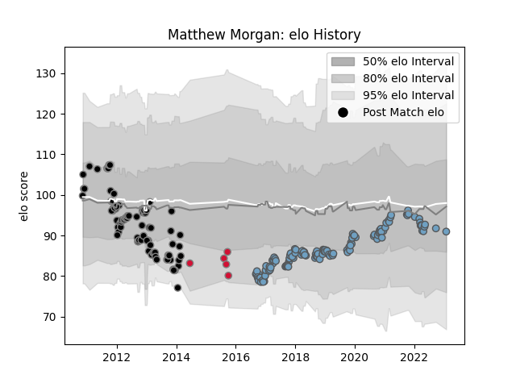

---  
layout: page  
title: Matthew Morgan  
date: 2023-02-02 19:04:18.049036  
categories: player  
---
# Matthew Morgan

## Positions: FB, FH

## Country: Wales

## Current elo: 91.0

## Current Percentile: 39.0

# Elo History

# Match History

| Team          |   Appearances |   Win Rate |
|:--------------|--------------:|-----------:|
| Cardiff Blues |           120 |   0.504167 |
| Ospreys       |            90 |   0.577778 |
| Wales         |             5 |   0.6      |

| Opponent           |   Matches |   Win Rate |
|:-------------------|----------:|-----------:|
| Benetton Treviso   |        17 |   0.794118 |
| Dragons            |        16 |   0.875    |
| Munster            |        15 |   0.433333 |
| Leinster           |        15 |   0.366667 |
| Scarlets           |        14 |   0.428571 |
| Connacht           |        14 |   0.642857 |
| Glasgow Warriors   |        13 |   0.153846 |
| Ulster             |        13 |   0.269231 |
| Edinburgh          |        13 |   0.615385 |
| Ospreys            |         9 |   0.333333 |
| Zebre              |         8 |   0.875    |
| Cardiff Blues      |         6 |   0.833333 |
| Pau                |         5 |   0.8      |
| Leicester Tigers   |         5 |   0.3      |
| Cheetahs           |         4 |   0.5      |
| Saracens           |         4 |   0        |
| Aironi             |         3 |   1        |
| Sale Sharks        |         3 |   0.666667 |
| Stade Toulousain   |         3 |   0.666667 |
| Exeter Chiefs      |         3 |   0        |
| Southern Kings     |         3 |   1        |
| Gloucester Rugby   |         3 |   0.666667 |
| Bath Rugby         |         2 |   0.5      |
| Castres Olympique  |         2 |   0.5      |
| Newcastle Falcons  |         2 |   0.5      |
| Northampton Saints |         2 |   0        |
| Biarritz Olympique |         2 |   0.5      |
| Bristol Rugby      |         2 |   1        |
| Lyon               |         2 |   1        |
| Stormers           |         1 |   0        |
| South Africa       |         1 |   0        |
| Uruguay            |         1 |   1        |
| Worcester Warriors |         1 |   0        |
| Fiji               |         1 |   1        |
| Sharks             |         1 |   1        |
| Bulls              |         1 |   0        |
| Lions              |         1 |   0        |
| Italy              |         1 |   1        |
| Ireland            |         1 |   0        |
| Harlequins         |         1 |   0        |
| Calvisano          |         1 |   1        |