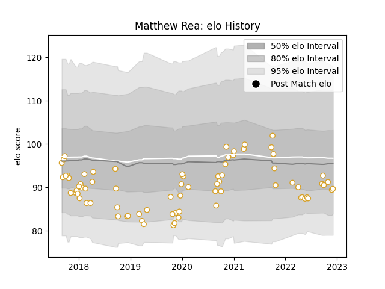

---  
layout: page  
title: Matthew Rea  
date: 2022-12-14 11:34:18.249728  
categories: player  
---
# Matthew Rea

## Positions: FL

## Current elo: 87.0

## Current Percentile: 23.0

# Elo History

# Match History

| Team   |   Appearances |   Win Rate |
|:-------|--------------:|-----------:|
| Ulster |            76 |   0.651316 |

| Opponent          |   Matches |   Win Rate |
|:------------------|----------:|-----------:|
| Munster           |         8 |   0.625    |
| Leinster          |         7 |   0.142857 |
| Connacht          |         7 |   0.428571 |
| Scarlets          |         6 |   0.833333 |
| Southern Kings    |         5 |   1        |
| Zebre             |         5 |   0.8      |
| Edinburgh         |         4 |   0.75     |
| Harlequins        |         4 |   1        |
| Dragons           |         4 |   1        |
| Ospreys           |         3 |   0.666667 |
| Glasgow Warriors  |         3 |   0.666667 |
| Benetton Treviso  |         3 |   1        |
| Cardiff Blues     |         3 |   0.666667 |
| La Rochelle       |         2 |   0.5      |
| Wasps             |         2 |   0.5      |
| Cheetahs          |         2 |   0.75     |
| Bulls             |         1 |   0        |
| Stormers          |         1 |   0        |
| Stade Toulousain  |         1 |   0        |
| Clermont Auvergne |         1 |   0        |
| Sharks            |         1 |   1        |
| Sale Sharks       |         1 |   0        |
| Lions             |         1 |   1        |
| Bath Rugby        |         1 |   1        |