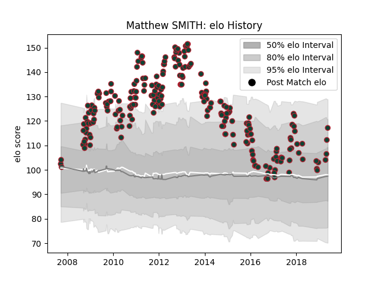

---  
layout: page  
title: Matthew SMITH  
date: 2023-01-17 11:31:33.761520  
categories: player  
---
# Matthew SMITH

## Positions: C, W

## Current elo: 117.0

## Current Percentile: 79.0

# Elo History

# Match History

| Team             |   Appearances |   Win Rate |
|:-----------------|--------------:|-----------:|
| Leicester Tigers |           237 |   0.649789 |

| Opponent             |   Matches |   Win Rate |
|:---------------------|----------:|-----------:|
| Bath Rugby           |        23 |   0.652174 |
| Northampton Saints   |        19 |   0.684211 |
| Harlequins           |        18 |   0.583333 |
| Gloucester Rugby     |        17 |   0.676471 |
| Wasps                |        17 |   0.352941 |
| Worcester Warriors   |        15 |   0.933333 |
| Sale Sharks          |        14 |   0.714286 |
| London Irish         |        14 |   0.892857 |
| Exeter Chiefs        |        13 |   0.615385 |
| Saracens             |        13 |   0.307692 |
| Newcastle Falcons    |        12 |   0.916667 |
| Benetton Treviso     |         8 |   1        |
| Bristol Rugby        |         6 |   0.666667 |
| Ospreys              |         4 |   0.625    |
| Perpignan            |         4 |   0.375    |
| Scarlets             |         4 |   0.75     |
| Racing 92            |         3 |   0        |
| London Welsh         |         3 |   1        |
| Toulon               |         3 |   0.333333 |
| Munster              |         3 |   0.666667 |
| Ulster               |         3 |   0.333333 |
| Cardiff Blues        |         3 |   0.5      |
| Yorkshire Carnegie   |         2 |   1        |
| Leinster             |         2 |   0        |
| Stade Toulousain     |         2 |   0.5      |
| Leeds                |         2 |   1        |
| Clermont Auvergne    |         2 |   0.5      |
| Stade Francais Paris |         2 |   0.5      |
| Aironi               |         1 |   1        |
| Arix Viadana         |         1 |   1        |
| Glasgow Warriors     |         1 |   0        |
| Dragons              |         1 |   1        |
| Castres Olympique    |         1 |   0        |
| Montpellier Herault  |         1 |   1        |