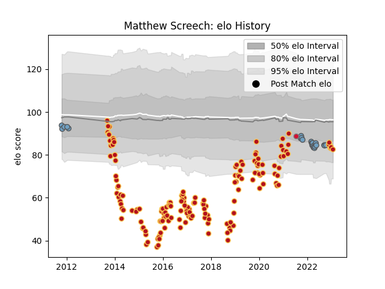

---  
layout: page  
title: Matthew Screech  
date: 2022-12-14 11:34:26.209999  
categories: player  
---
# Matthew Screech

## Positions: L

## Country: Wales

## Current elo: 84.0

## Current Percentile: 10.0

# Elo History

# Match History

| Team          |   Appearances |   Win Rate |
|:--------------|--------------:|-----------:|
| Dragons       |           160 |   0.315625 |
| Cardiff Blues |            23 |   0.347826 |
| Wales         |             1 |   0        |

| Opponent            |   Matches |   Win Rate |
|:--------------------|----------:|-----------:|
| Scarlets            |        17 |   0.294118 |
| Ospreys             |        14 |   0.178571 |
| Glasgow Warriors    |        13 |   0.461538 |
| Leinster            |        13 |   0.153846 |
| Ulster              |        13 |   0.192308 |
| Munster             |        12 |   0.166667 |
| Edinburgh           |        11 |   0.181818 |
| Cardiff Blues       |         9 |   0        |
| Benetton Treviso    |         9 |   0.333333 |
| Zebre               |         8 |   0.5625   |
| Connacht            |         6 |   0.5      |
| Newcastle Falcons   |         4 |   0        |
| Castres Olympique   |         4 |   0.5      |
| Worcester Warriors  |         4 |   0.5      |
| RC Enisei           |         4 |   0.75     |
| Northampton Saints  |         4 |   0        |
| Gloucester Rugby    |         3 |   0.333333 |
| Lions               |         3 |   0.166667 |
| Dragons             |         3 |   1        |
| Southern Kings      |         3 |   0.833333 |
| Clermont Auvergne   |         2 |   0        |
| Cheetahs            |         2 |   0.5      |
| Mogliano            |         2 |   1        |
| Sale Sharks         |         2 |   0.5      |
| Stormers            |         2 |   0        |
| Timisoara Saracens  |         2 |   1        |
| Bordeaux Begles     |         2 |   0.5      |
| Bath Rugby          |         2 |   0        |
| Pau                 |         2 |   1        |
| Aironi              |         1 |   1        |
| Montpellier Herault |         1 |   0        |
| Argentina           |         1 |   0        |
| Exeter Chiefs       |         1 |   0        |
| Bulls               |         1 |   0        |
| Bucuresti           |         1 |   1        |
| Brive               |         1 |   1        |
| Bristol Rugby       |         1 |   0        |
| Leicester Tigers    |         1 |   0        |