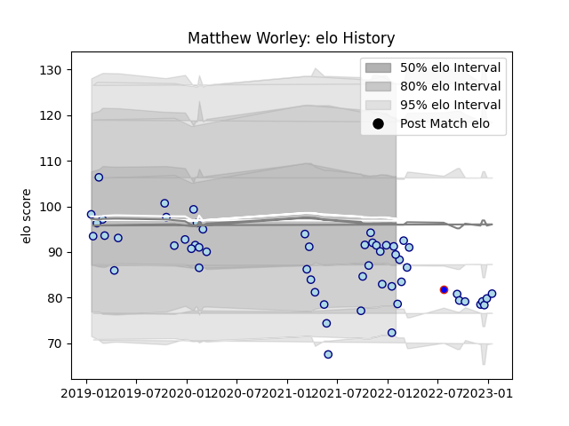

---  
layout: page  
title: Matthew Worley  
date: 2023-01-21 15:42:42.518175  
categories: player  
---
# Matthew Worley

## Positions: W, C

## Country: Hong Kong

## Current elo: 89.0

## Current Percentile: 15.0

# Elo History

# Match History

| Team      |   Appearances |   Win Rate |
|:----------|--------------:|-----------:|
| Bedford   |            56 |   0.410714 |
| Hong Kong |             1 |   0        |

| Opponent            |   Matches |   Win Rate |
|:--------------------|----------:|-----------:|
| Coventry            |         7 |   0.285714 |
| Ampthill            |         6 |   0.5      |
| Ealing Trailfinders |         6 |   0.166667 |
| Jersey              |         6 |   0.333333 |
| Doncaster           |         5 |   0.4      |
| London Scottish     |         5 |   1        |
| Nottingham          |         5 |   0.6      |
| Cornish Pirates     |         4 |   0        |
| Hartpury College    |         4 |   0.75     |
| Richmond            |         3 |   0.333333 |
| Yorkshire Carnegie  |         2 |   0.5      |
| London Irish        |         1 |   0        |
| Newcastle Falcons   |         1 |   0        |
| Saracens            |         1 |   0        |
| Tonga               |         1 |   0        |