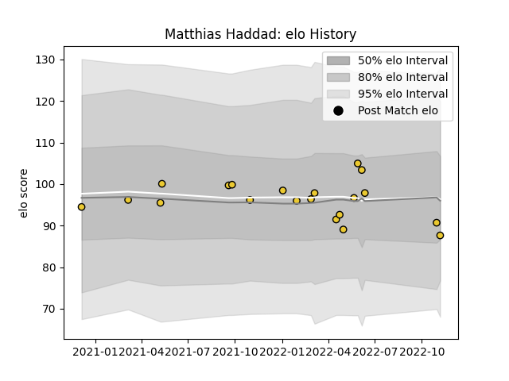

---  
layout: page  
title: Matthias Haddad  
date: 2023-03-27 11:31:15.096799  
categories: player  
---
# Matthias Haddad

Last updated: 2023-03-27
## Positions: FL, N8

## Current elo: 88.0

## Current Percentile: 34.0

# Elo History

# Match History

| Team        |   Appearances |   Win Rate |
|:------------|--------------:|-----------:|
| La Rochelle |            20 |       0.45 |

| Opponent             |   Matches |   Win Rate |
|:---------------------|----------:|-----------:|
| Brive                |         3 |   0.666667 |
| Castres Olympique    |         2 |   0        |
| Lyon                 |         2 |   0.5      |
| Montpellier Herault  |         2 |   0        |
| Pau                  |         2 |   0.5      |
| Perpignan            |         2 |   0.5      |
| Stade Toulousain     |         2 |   0        |
| Biarritz Olympique   |         1 |   1        |
| Bordeaux Begles      |         1 |   1        |
| Clermont Auvergne    |         1 |   0        |
| Leinster             |         1 |   1        |
| Stade Francais Paris |         1 |   1        |