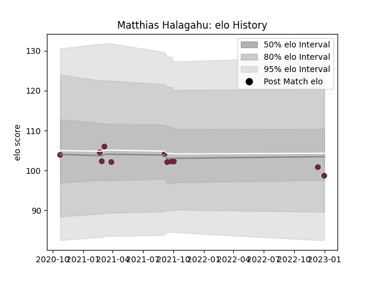

---  
layout: page  
title: Matthias Halagahu  
date: 2022-12-18 16:28:27.640132  
categories: player  
---
# Matthias Halagahu

## Positions: L, FL

## Current elo: 94.0

## Current Percentile: None

# Elo History

# Match History

| Team   |   Appearances |   Win Rate |
|:-------|--------------:|-----------:|
| Toulon |            10 |       0.45 |

| Opponent            |   Matches |   Win Rate |
|:--------------------|----------:|-----------:|
| Castres Olympique   |         2 |        0.5 |
| Bayonne             |         1 |        0   |
| Lyon                |         1 |        0   |
| Montpellier Herault |         1 |        0.5 |
| Pau                 |         1 |        1   |
| Perpignan           |         1 |        0   |
| Racing 92           |         1 |        1   |
| Stade Toulousain    |         1 |        0   |
| Zebre               |         1 |        1   |