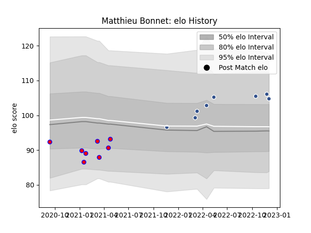

---  
layout: page  
title: Matthieu Bonnet  
date: 2022-12-09 13:09:30.693457  
categories: player  
---
# Matthieu Bonnet

## Positions: N8, FL

## Current elo: 105.0

## Current Percentile: 79.0

# Elo History

# Match History

| Team    |   Appearances |   Win Rate |
|:--------|--------------:|-----------:|
| Agen    |             8 |      0.375 |
| Blagnac |             8 |      0.5   |

| Opponent           |   Matches |   Win Rate |
|:-------------------|----------:|-----------:|
| Massy              |         3 |   0.666667 |
| Carcassonne        |         2 |   0.5      |
| US Bressane        |         2 |   0        |
| Aubenas            |         1 |   1        |
| Aurillac           |         1 |   0        |
| Biarritz Olympique |         1 |   1        |
| Chambery           |         1 |   1        |
| Colomiers          |         1 |   0        |
| Dax                |         1 |   1        |
| Dijon              |         1 |   0        |
| Oyonnax            |         1 |   0        |
| Rouen              |         1 |   0        |