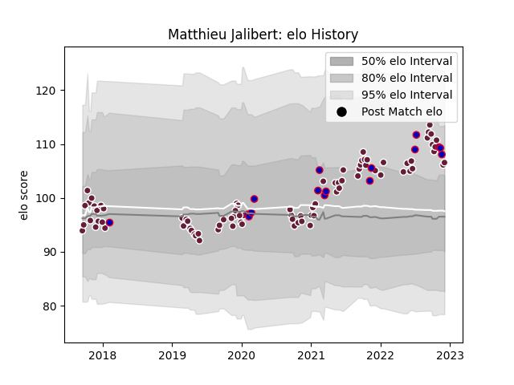

---  
layout: page  
title: Matthieu Jalibert  
date: 2023-01-06 00:23:05.307608  
categories: player  
---
# Matthieu Jalibert

## Positions: FH

## Country: France

## Current elo: 118.0

## Current Percentile: 79.0

# Elo History

# Match History

| Team            |   Appearances |   Win Rate |
|:----------------|--------------:|-----------:|
| Bordeaux Begles |            88 |   0.625    |
| France          |            17 |   0.823529 |

| Opponent             |   Matches |   Win Rate |
|:---------------------|----------:|-----------:|
| Lyon                 |         8 |   0.5      |
| Stade Toulousain     |         8 |   0.25     |
| Montpellier Herault  |         8 |   0.5625   |
| Racing 92            |         6 |   0.666667 |
| Castres Olympique    |         6 |   0.75     |
| La Rochelle          |         5 |   0.6      |
| Toulon               |         5 |   0.4      |
| Stade Francais Paris |         5 |   0.8      |
| Perpignan            |         4 |   0.5      |
| Pau                  |         4 |   0.75     |
| Agen                 |         4 |   1        |
| Bayonne              |         4 |   0.75     |
| Brive                |         4 |   0.875    |
| Clermont Auvergne    |         3 |   0.666667 |
| Japan                |         3 |   1        |
| Edinburgh            |         3 |   0.833333 |
| Newcastle Falcons    |         2 |   0        |
| Wales                |         2 |   1        |
| Biarritz Olympique   |         2 |   0.5      |
| England              |         2 |   0.5      |
| Italy                |         2 |   1        |
| Ireland              |         2 |   0.5      |
| New Zealand          |         1 |   1        |
| Dragons              |         1 |   1        |
| Oyonnax              |         1 |   1        |
| Georgia              |         1 |   1        |
| Argentina            |         1 |   1        |
| RC Enisei            |         1 |   1        |
| Bristol Rugby        |         1 |   0        |
| Scarlets             |         1 |   1        |
| Scotland             |         1 |   0        |
| South Africa         |         1 |   1        |
| Australia            |         1 |   1        |
| Grenoble             |         1 |   1        |
| Wasps                |         1 |   1        |