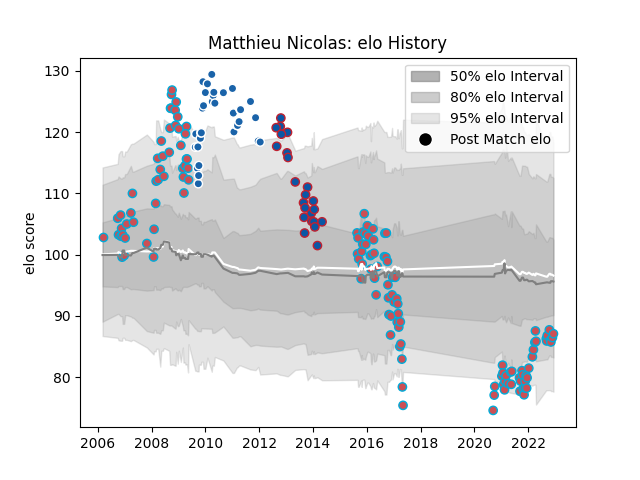

---  
layout: page  
title: Matthieu Nicolas  
date: 2022-12-18 16:37:04.728739  
categories: player  
---
# Matthieu Nicolas

## Positions: W, FB

## Current elo: 87.0

## Current Percentile: 14.0

# Elo History

# Match History

| Team              |   Appearances |   Win Rate |
|:------------------|--------------:|-----------:|
| Bourgoin-Jallieu  |           135 |   0.407407 |
| Castres Olympique |            34 |   0.5      |
| Grenoble          |            23 |   0.5      |

| Opponent                   |   Matches |   Win Rate |
|:---------------------------|----------:|-----------:|
| Biarritz Olympique         |        13 |   0.615385 |
| Stade Francais Paris       |        11 |   0.318182 |
| Dax                        |        10 |   0.4      |
| Stade Toulousain           |        10 |   0.2      |
| Montauban                  |         9 |   0.611111 |
| Bayonne                    |         9 |   0.5      |
| Albi                       |         8 |   0.375    |
| Perpignan                  |         8 |   0.125    |
| Clermont Auvergne          |         8 |   0.1875   |
| Narbonne                   |         7 |   0.428571 |
| Brive                      |         7 |   0.357143 |
| Tarbes                     |         6 |   0.5      |
| Castres Olympique          |         5 |   0.6      |
| Toulon                     |         5 |   0.6      |
| Nice                       |         4 |   0.25     |
| Mont-de-Marsan             |         4 |   0.5      |
| Chambery                   |         4 |   0.5      |
| Dijon                      |         4 |   0.75     |
| Bourgoin-Jallieu           |         3 |   0.666667 |
| Blagnac                    |         3 |   0.666667 |
| Montpellier Herault        |         3 |   0.666667 |
| Aurillac                   |         3 |   0.666667 |
| Colomiers                  |         3 |   0.666667 |
| Cognac Saint Jean d'Angély |         3 |   1        |
| Beziers                    |         3 |   0        |
| Agen                       |         3 |   0.333333 |
| Valence Romans Drome Rugby |         2 |   0.5      |
| Oyonnax                    |         2 |   0        |
| Provence Rugby             |         2 |   0.5      |
| Vannes                     |         2 |   0.25     |
| Soyaux-Angouleme           |         2 |   0        |
| Northampton Saints         |         2 |   0        |
| Lyon                       |         2 |   0        |
| Wasps                      |         2 |   0        |
| Arix Viadana               |         2 |   0.75     |
| Cavalieri Prato            |         2 |   1        |
| Aubenas                    |         2 |   0.5      |
| Bordeaux Begles            |         2 |   1        |
| Carcassonne                |         1 |   0        |
| US Bressane                |         1 |   0        |
| Auch                       |         1 |   1        |
| Suresnes                   |         1 |   0        |
| Munster                    |         1 |   0        |
| Massy                      |         1 |   0        |
| Carqueiranne-Hyères        |         1 |   1        |
| Scarlets                   |         1 |   0        |
| Rennes                     |         1 |   1        |
| Racing 92                  |         1 |   1        |
| London Irish               |         1 |   1        |
| Cardiff Blues              |         1 |   0        |