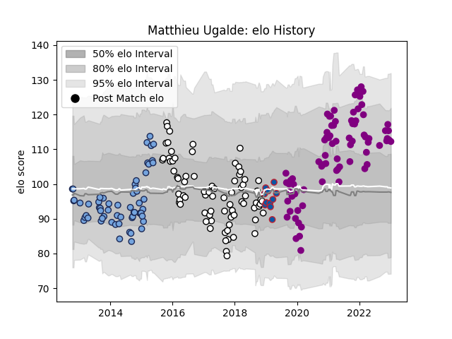

---  
layout: page  
title: Matthieu Ugalde  
date: 2023-01-13 11:30:05.522812  
categories: player  
---
# Matthieu Ugalde

## Positions: FH, C

## Current elo: 112.0

## Current Percentile: 79.0

# Elo History

# Match History

| Team             |   Appearances |   Win Rate |
|:-----------------|--------------:|-----------:|
| Soyaux-Angouleme |            79 |   0.506329 |
| Brive            |            77 |   0.493506 |
| Bayonne          |            59 |   0.5      |
| Grenoble         |            11 |   0.181818 |

| Opponent                   |   Matches |   Win Rate |
|:---------------------------|----------:|-----------:|
| Grenoble                   |        15 |   0.433333 |
| Bordeaux Begles            |        10 |   0.45     |
| Montpellier Herault        |        10 |   0.5      |
| Oyonnax                    |        10 |   0.5      |
| Stade Toulousain           |         9 |   0.277778 |
| Toulon                     |         9 |   0.444444 |
| Stade Francais Paris       |         8 |   0.625    |
| Racing 92                  |         8 |   0.125    |
| Biarritz Olympique         |         8 |   0.4375   |
| Castres Olympique          |         8 |   0.625    |
| La Rochelle                |         8 |   0.375    |
| Clermont Auvergne          |         8 |   0.25     |
| Agen                       |         7 |   0.571429 |
| Perpignan                  |         6 |   0.166667 |
| Connacht                   |         6 |   0.166667 |
| Nevers                     |         5 |   0.5      |
| Vannes                     |         5 |   0.6      |
| Montauban                  |         5 |   0.3      |
| Lyon                       |         5 |   0.3      |
| Colomiers                  |         4 |   0.75     |
| Massy                      |         4 |   0.5      |
| Valence Romans Drome Rugby |         4 |   0.625    |
| Mont-de-Marsan             |         4 |   0.5      |
| Pau                        |         4 |   0.5      |
| Dragons                    |         3 |   1        |
| Carcassonne                |         3 |   0.166667 |
| Brive                      |         3 |   0.333333 |
| Aurillac                   |         3 |   0.666667 |
| Beziers                    |         3 |   1        |
| Rouen                      |         3 |   0.666667 |
| Cognac Saint Jean d'Angély |         2 |   1        |
| Bayonne                    |         2 |   0        |
| Arix Viadana               |         2 |   1        |
| Dijon                      |         2 |   0.5      |
| Aubenas                    |         2 |   1        |
| Tarbes                     |         2 |   0.5      |
| Suresnes                   |         2 |   1        |
| Roval Drome XV             |         2 |   0.5      |
| Worcester Warriors         |         2 |   0.5      |
| Chambery                   |         2 |   0        |
| Provence Rugby             |         2 |   1        |
| Dax                        |         2 |   0.5      |
| Blagnac                    |         2 |   1        |
| Nice                       |         2 |   0.5      |
| Exeter Chiefs              |         2 |   0.5      |
| Albi                       |         2 |   1        |
| Soyaux-Angouleme           |         1 |   1        |
| Bath Rugby                 |         1 |   0        |
| Bourgoin-Jallieu           |         1 |   1        |
| Mogliano                   |         1 |   1        |
| Wasps                      |         1 |   0        |
| RC Enisei                  |         1 |   1        |