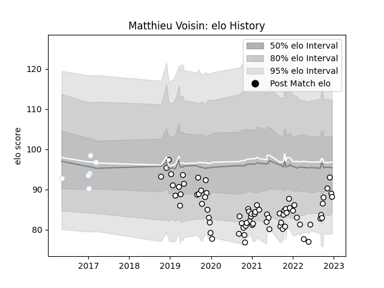

---  
layout: page  
title: Matthieu Voisin  
date: 2022-12-18 16:35:32.426947  
categories: player  
---
# Matthieu Voisin

## Positions: FL, N8

## Current elo: 88.0

## Current Percentile: 22.0

# Elo History

# Match History

| Team      |   Appearances |   Win Rate |
|:----------|--------------:|-----------:|
| Brive     |            74 |   0.371622 |
| Racing 92 |             6 |   0.166667 |

| Opponent             |   Matches |   Win Rate |
|:---------------------|----------:|-----------:|
| La Rochelle          |         7 |   0.142857 |
| Pau                  |         6 |   0.666667 |
| Lyon                 |         5 |   0.2      |
| Bayonne              |         5 |   0.7      |
| Stade Toulousain     |         5 |   0.2      |
| Stade Francais Paris |         5 |   0.8      |
| Racing 92            |         5 |   0.2      |
| Castres Olympique    |         5 |   0.2      |
| Toulon               |         4 |   0.25     |
| Montpellier Herault  |         4 |   0.25     |
| Leicester Tigers     |         2 |   0.5      |
| Perpignan            |         2 |   1        |
| Munster              |         2 |   0        |
| Mont-de-Marsan       |         2 |   0.5      |
| Agen                 |         2 |   0.5      |
| Clermont Auvergne    |         2 |   0.5      |
| Bristol Rugby        |         2 |   0        |
| Biarritz Olympique   |         2 |   0.5      |
| Aurillac             |         1 |   0        |
| Massy                |         1 |   0        |
| Connacht             |         1 |   0        |
| Montauban            |         1 |   0        |
| Colomiers            |         1 |   0        |
| Nevers               |         1 |   1        |
| Oyonnax              |         1 |   1        |
| Cardiff Blues        |         1 |   0        |
| Brive                |         1 |   0        |
| Saracens             |         1 |   0        |
| Bordeaux Begles      |         1 |   0        |
| Beziers              |         1 |   0        |
| Zebre                |         1 |   1        |