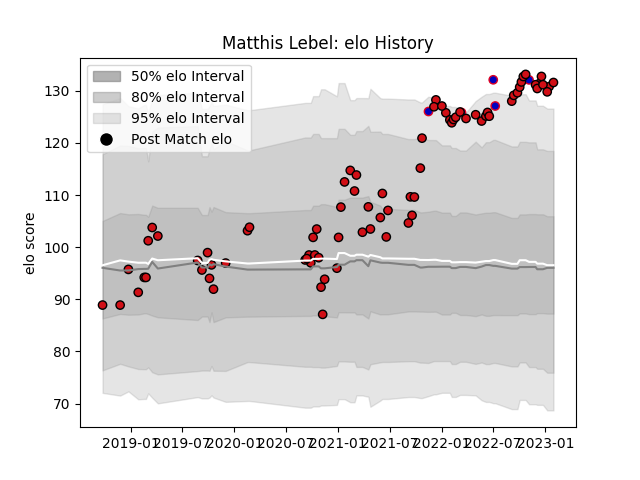

---  
layout: page  
title: Matthis Lebel  
date: 2022-12-18 16:36:10.580705  
categories: player  
---
# Matthis Lebel

## Positions: W

## Country: France

## Current elo: 131.0

## Current Percentile: 98.0

# Elo History

# Match History

| Team             |   Appearances |   Win Rate |
|:-----------------|--------------:|-----------:|
| Stade Toulousain |            74 |   0.675676 |
| France           |             5 |   1        |

| Opponent             |   Matches |   Win Rate |
|:---------------------|----------:|-----------:|
| Montpellier Herault  |         8 |   0.625    |
| La Rochelle          |         7 |   1        |
| Bordeaux Begles      |         6 |   0.666667 |
| Clermont Auvergne    |         6 |   0.583333 |
| Racing 92            |         6 |   0.666667 |
| Pau                  |         5 |   0.8      |
| Brive                |         5 |   0.8      |
| Castres Olympique    |         5 |   0.5      |
| Stade Francais Paris |         5 |   0.4      |
| Lyon                 |         5 |   0.4      |
| Toulon               |         4 |   0.75     |
| Japan                |         2 |   1        |
| Perpignan            |         2 |   0.5      |
| Wales                |         1 |   1        |
| Ulster               |         1 |   1        |
| Sale Sharks          |         1 |   1        |
| Agen                 |         1 |   1        |
| Munster              |         1 |   1        |
| Australia            |         1 |   1        |
| Grenoble             |         1 |   1        |
| Georgia              |         1 |   1        |
| Exeter Chiefs        |         1 |   0        |
| Cardiff Blues        |         1 |   1        |
| Biarritz Olympique   |         1 |   1        |
| Bayonne              |         1 |   1        |
| Wasps                |         1 |   0        |