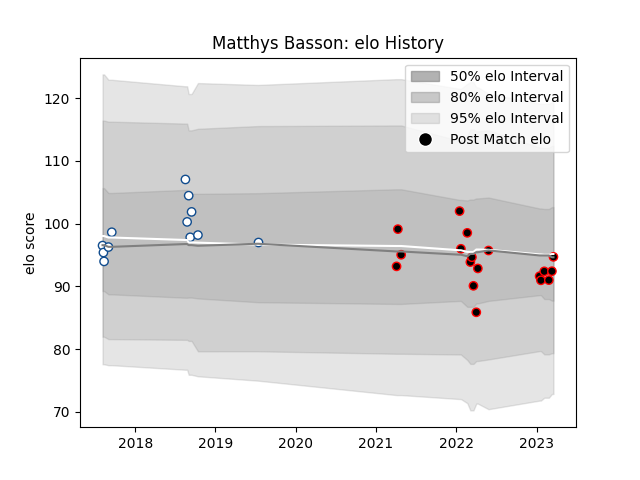

---  
layout: page  
title: Matthys Basson  
date: 2023-01-15 11:44:54.903472  
categories: player  
---
# Matthys Basson

## Positions: P

## Current elo: 90.0

## Current Percentile: 40.0

# Elo History

# Match History

| Team           |   Appearances |   Win Rate |
|:---------------|--------------:|-----------:|
| Blue Bulls     |            12 |   0.416667 |
| Mie Honda Heat |             9 |   0.777778 |

| Opponent                 |   Matches |   Win Rate |
|:-------------------------|----------:|-----------:|
| Golden Lions             |         3 |   0.333333 |
| Western Province         |         3 |   0        |
| Griquas                  |         2 |   1        |
| Hanazono Kintetsu Liners |         2 |   0        |
| Hino Red Dolphins        |         2 |   1        |
| Kamaishi Seawaves        |         2 |   1        |
| Natal Sharks             |         2 |   0        |
| Skyactivs Hiroshima      |         2 |   1        |
| Free State Cheetahs      |         1 |   1        |
| Mitsubishi Dynaboars     |         1 |   1        |
| Pumas                    |         1 |   1        |