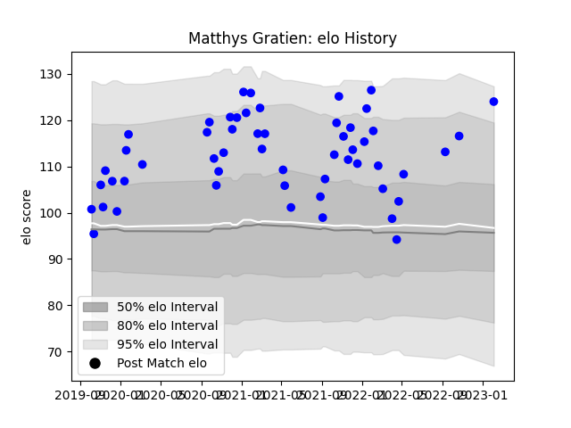

---  
layout: page  
title: Matthys Gratien  
date: 2023-02-04 17:25:07.386375  
categories: player  
---
# Matthys Gratien

## Positions: W

## Current elo: 124.0

## Current Percentile: 87.0

# Elo History

# Match History

| Team   |   Appearances |   Win Rate |
|:-------|--------------:|-----------:|
| Vannes |            54 |   0.601852 |

| Opponent                   |   Matches |   Win Rate |
|:---------------------------|----------:|-----------:|
| Nevers                     |         5 |       0.5  |
| Colomiers                  |         5 |       0.6  |
| Grenoble                   |         5 |       0.6  |
| Mont-de-Marsan             |         4 |       1    |
| Soyaux-Angouleme           |         4 |       0.75 |
| Biarritz Olympique         |         4 |       0.25 |
| Rouen                      |         4 |       0.25 |
| Montauban                  |         4 |       0.75 |
| Beziers                    |         3 |       1    |
| Provence Rugby             |         2 |       1    |
| Oyonnax                    |         2 |       0.5  |
| Agen                       |         2 |       0.5  |
| Aurillac                   |         2 |       1    |
| Carcassonne                |         2 |       0.25 |
| Bayonne                    |         2 |       0    |
| Narbonne                   |         1 |       0.5  |
| Perpignan                  |         1 |       0    |
| Massy                      |         1 |       1    |
| Valence Romans Drome Rugby |         1 |       1    |