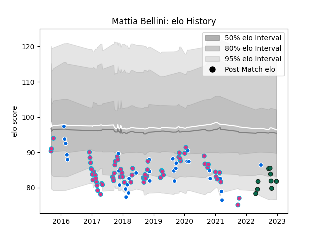

---  
layout: page  
title: Mattia Bellini  
date: 2022-12-28 12:54:20.348462  
categories: player  
---
# Mattia Bellini

## Positions: W

## Country: Italy

## Current elo: 82.0

## Current Percentile: 6.0

# Elo History

# Match History

| Team             |   Appearances |   Win Rate |
|:-----------------|--------------:|-----------:|
| Zebre            |            64 |   0.226562 |
| Italy            |            32 |   0.21875  |
| Benetton Treviso |             9 |   0.444444 |

| Opponent         |   Matches |   Win Rate |
|:-----------------|----------:|-----------:|
| Benetton Treviso |        10 |   0.4      |
| Cardiff Blues    |         6 |   0.333333 |
| Ospreys          |         5 |   0.2      |
| Scarlets         |         5 |   0        |
| Leinster         |         5 |   0        |
| Ireland          |         5 |   0        |
| Connacht         |         5 |   0.2      |
| Edinburgh        |         5 |   0.2      |
| Scotland         |         4 |   0        |
| Glasgow Warriors |         4 |   0        |
| France           |         4 |   0        |
| Ulster           |         4 |   0.25     |
| England          |         4 |   0        |
| Dragons          |         4 |   0.25     |
| Wales            |         4 |   0        |
| Bristol Rugby    |         4 |   0.375    |
| Cheetahs         |         3 |   0.333333 |
| Georgia          |         2 |   1        |
| Stade Toulousain |         2 |   0        |
| Bulls            |         2 |   0        |
| Southern Kings   |         2 |   1        |
| Namibia          |         2 |   1        |
| Zebre            |         2 |   1        |
| South Africa     |         1 |   0        |
| Wasps            |         1 |   0        |
| Agen             |         1 |   1        |
| Russia           |         1 |   1        |
| Munster          |         1 |   0        |
| Lions            |         1 |   0        |
| Japan            |         1 |   0        |
| Argentina        |         1 |   0        |
| Fiji             |         1 |   1        |
| Canada           |         1 |   1        |
| Australia        |         1 |   0        |
| Gloucester Rugby |         1 |   0        |