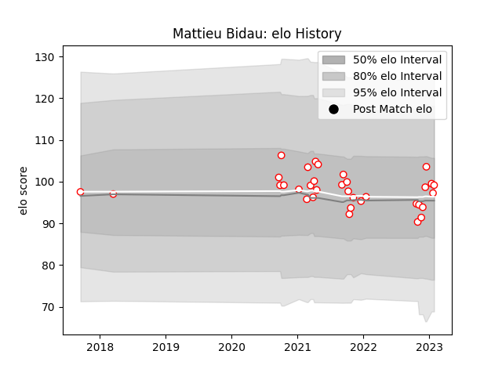

---  
layout: page  
title: Mattieu Bidau  
date: 2022-12-14 11:12:53.174523  
categories: player  
---
# Mattieu Bidau

## Positions: L

## Current elo: 101.0

## Current Percentile: 60.0

# Elo History

# Match History

| Team   |   Appearances |   Win Rate |
|:-------|--------------:|-----------:|
| Dax    |            22 |   0.590909 |

| Opponent                   |   Matches |   Win Rate |
|:---------------------------|----------:|-----------:|
| Albi                       |         3 |   0.333333 |
| Tarbes                     |         3 |   0.333333 |
| Blagnac                    |         2 |   1        |
| Chambery                   |         2 |   0.5      |
| Narbonne                   |         2 |   1        |
| Aubenas                    |         1 |   1        |
| Bourgoin-Jallieu           |         1 |   1        |
| Carqueiranne-Hyères        |         1 |   1        |
| Massy                      |         1 |   0        |
| Nice                       |         1 |   1        |
| Rennes                     |         1 |   1        |
| Soyaux-Angouleme           |         1 |   0        |
| Suresnes                   |         1 |   0        |
| US Bressane                |         1 |   0        |
| Valence Romans Drome Rugby |         1 |   1        |