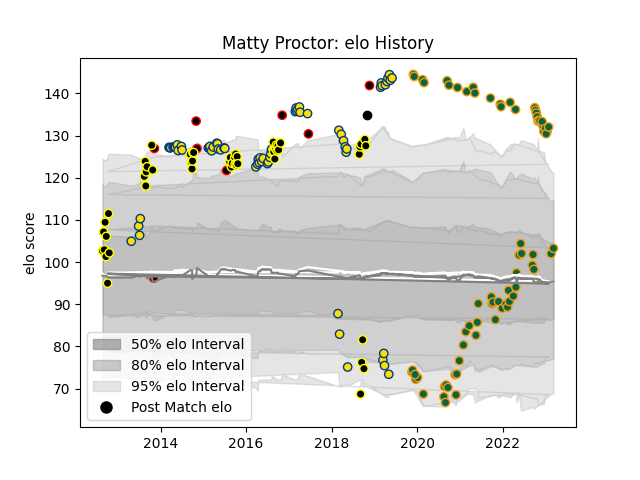

---  
layout: page  
title: Matty Proctor  
date: 2023-02-06 11:16:18.039662  
categories: player  
---
# Matty Proctor

## Positions: C, W

## Country: New Zealand Maori

## Current elo: 96.0

## Current Percentile: 96.0

# Elo History

# Match History

| Team               |   Appearances |   Win Rate |
|:-------------------|--------------:|-----------:|
| Northampton Saints |            69 |   0.376812 |
| Hurricanes         |            67 |   0.738806 |
| Wellington         |            50 |   0.63     |
| New Zealand Maori  |             8 |   0.875    |
| New Zealand        |             1 |   1        |

| Opponent                 |   Matches |   Win Rate |
|:-------------------------|----------:|-----------:|
| Chiefs                   |        10 |   0.45     |
| Exeter Chiefs            |         9 |   0.333333 |
| Leicester Tigers         |         8 |   0.375    |
| Crusaders                |         8 |   0.5      |
| Highlanders              |         8 |   0.625    |
| Gloucester Rugby         |         6 |   0.333333 |
| Blues                    |         6 |   0.833333 |
| Bristol Rugby            |         6 |   0.5      |
| North Harbour            |         6 |   0.833333 |
| Harlequins               |         6 |   0.333333 |
| Counties Manukau         |         5 |   0.8      |
| Melbourne Rebels         |         5 |   1        |
| Manawatu                 |         5 |   0.6      |
| Queensland Reds          |         5 |   1        |
| Sale Sharks              |         5 |   0        |
| Taranaki                 |         5 |   0.8      |
| Wasps                    |         5 |   0.6      |
| Southland                |         4 |   1        |
| Hawke's Bay              |         4 |   0.375    |
| Auckland                 |         4 |   0        |
| Lions                    |         4 |   1        |
| Canterbury               |         4 |   0        |
| Otago                    |         3 |   0.666667 |
| Sunwolves                |         3 |   1        |
| Saracens                 |         3 |   0        |
| Newcastle Falcons        |         3 |   0.666667 |
| New South Wales Waratahs |         3 |   0.666667 |
| Sharks                   |         3 |   1        |
| London Irish             |         3 |   1        |
| Bath Rugby               |         3 |   0.333333 |
| Waikato                  |         3 |   0.666667 |
| Bay of Plenty            |         3 |   1        |
| Japan                    |         3 |   1        |
| Jaguares                 |         3 |   0.666667 |
| Northland                |         3 |   1        |
| Brumbies                 |         2 |   1        |
| United States of America |         2 |   1        |
| Stormers                 |         2 |   0.5      |
| Worcester Warriors       |         2 |   1        |
| Bulls                    |         2 |   0.5      |
| Munster                  |         2 |   0        |
| Leinster                 |         2 |   0        |
| Chile                    |         1 |   1        |
| Tasman                   |         1 |   0        |
| Western Force            |         1 |   1        |
| La Rochelle              |         1 |   0        |
| Cheetahs                 |         1 |   1        |
| Ulster                   |         1 |   0        |
| Lyon                     |         1 |   1        |
| Benetton Treviso         |         1 |   1        |
| Racing 92                |         1 |   0        |
| Canada                   |         1 |   1        |
| Bordeaux Begles          |         1 |   0        |
| Southern Kings           |         1 |   1        |
| British and Irish Lions  |         1 |   0        |
| Fiji                     |         1 |   1        |