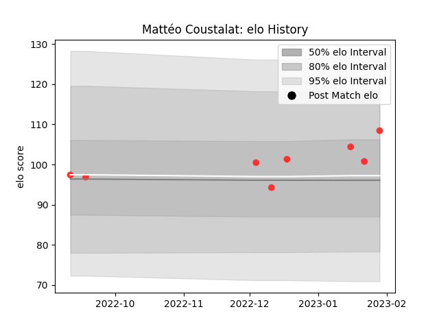

---  
layout: page  
title: Mattéo Coustalat  
date: 2023-01-17 11:45:01.909663  
categories: player  
---
# Mattéo Coustalat

## Positions: FL

## Current elo: 104.0

## Current Percentile: 65.0

# Elo History

# Match History

| Team   |   Appearances |   Win Rate |
|:-------|--------------:|-----------:|
| Tarbes |             6 |        0.5 |

| Opponent                   |   Matches |   Win Rate |
|:---------------------------|----------:|-----------:|
| Cognac Saint Jean d'Angély |         2 |          1 |
| Blagnac                    |         1 |          0 |
| Chambery                   |         1 |          1 |
| Dax                        |         1 |          0 |
| US Bressane                |         1 |          0 |