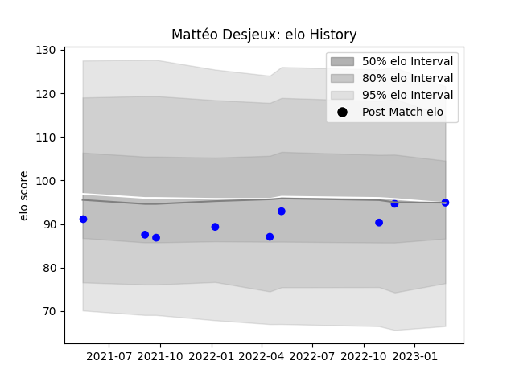

---  
layout: page  
title: Mattéo Desjeux  
date: 2023-03-21 18:27:33.033069  
categories: player  
---
# Mattéo Desjeux

Last updated: 2023-03-21
## Positions: L

## Current elo: 95.0

## Current Percentile: 47.0

# Elo History

# Match History

| Team   |   Appearances |   Win Rate |
|:-------|--------------:|-----------:|
| Vannes |            10 |       0.45 |

| Opponent   |   Matches |   Win Rate |
|:-----------|----------:|-----------:|
| Aurillac   |         2 |        1   |
| Oyonnax    |         2 |        0.5 |
| Agen       |         1 |        0   |
| Colomiers  |         1 |        0   |
| Grenoble   |         1 |        0   |
| Montauban  |         1 |        0.5 |
| Nevers     |         1 |        1   |
| Perpignan  |         1 |        0   |