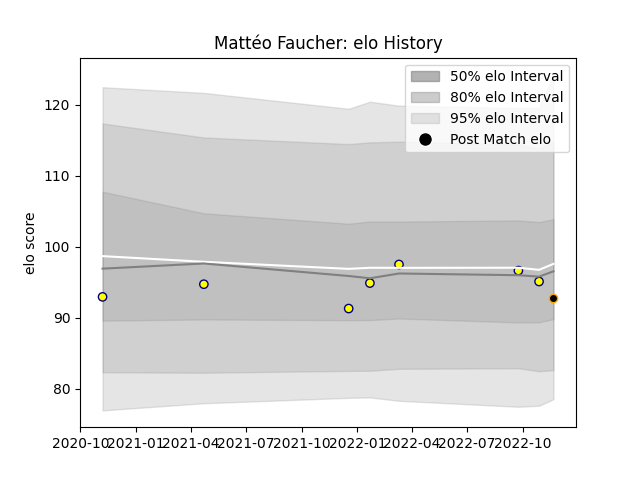

---  
layout: page  
title: Mattéo Faucher  
date: 2022-12-14 11:27:34.930587  
categories: player  
---
# Mattéo Faucher

## Positions: C, FH

## Current elo: 92.0

## Current Percentile: 23.0

# Elo History

# Match History

| Team     |   Appearances |   Win Rate |
|:---------|--------------:|-----------:|
| Nevers   |             7 |   0.142857 |
| Chambery |             4 |   0.25     |

| Opponent                   |   Matches |   Win Rate |
|:---------------------------|----------:|-----------:|
| Oyonnax                    |         2 |          0 |
| Albi                       |         1 |          0 |
| Bourgoin-Jallieu           |         1 |          0 |
| Carcassonne                |         1 |          0 |
| Grenoble                   |         1 |          0 |
| Montauban                  |         1 |          0 |
| Narbonne                   |         1 |          1 |
| Perpignan                  |         1 |          0 |
| Suresnes                   |         1 |          0 |
| Valence Romans Drome Rugby |         1 |          1 |