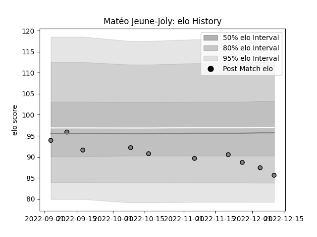

---  
layout: page  
title: Matéo Jeune-Joly  
date: 2023-02-02 18:55:23.131010  
categories: player  
---
# Matéo Jeune-Joly

## Positions: SH

## Current elo: 97.0

## Current Percentile: 53.0

# Elo History

# Match History

| Team      |   Appearances |   Win Rate |
|:----------|--------------:|-----------:|
| Rennes    |            14 |  0.0714286 |
| Perpignan |             5 |  0.8       |

| Opponent                   |   Matches |   Win Rate |
|:---------------------------|----------:|-----------:|
| Albi                       |         2 |          0 |
| Suresnes                   |         2 |          0 |
| Valence Romans Drome Rugby |         2 |          0 |
| Beziers                    |         1 |          1 |
| Bourgoin-Jallieu           |         1 |          0 |
| Carqueiranne-Hyères        |         1 |          1 |
| Chambery                   |         1 |          0 |
| Dax                        |         1 |          0 |
| Narbonne                   |         1 |          0 |
| Nevers                     |         1 |          1 |
| Nice                       |         1 |          0 |
| Provence Rugby             |         1 |          1 |
| Rouen                      |         1 |          0 |
| Tarbes                     |         1 |          0 |
| US Bressane                |         1 |          0 |
| Vannes                     |         1 |          1 |