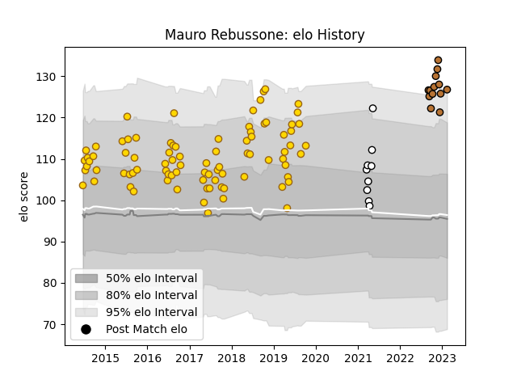

---  
layout: page  
title: Mauro Rebussone  
date: 2022-12-14 11:13:30.951649  
categories: player  
---
# Mauro Rebussone

## Positions: L

## Current elo: 99.0

## Current Percentile: 77.0

# Elo History

# Match History

| Team          |   Appearances |   Win Rate |
|:--------------|--------------:|-----------:|
| Belgrano      |            58 |   0.698276 |
| Narbonne      |            11 |   0.590909 |
| Olimpia Lions |             8 |   0.375    |

| Opponent                   |   Matches |   Win Rate |
|:---------------------------|----------:|-----------:|
| Pucara                     |         6 |   0.833333 |
| CUBA                       |         6 |   0.666667 |
| Hindu                      |         6 |   0.666667 |
| SIC                        |         6 |   0.333333 |
| Regatas Bella Vista        |         5 |   1        |
| San Luis                   |         5 |   0.8      |
| CASI                       |         4 |   1        |
| La Plata                   |         4 |   0.75     |
| Alumni                     |         4 |   0.25     |
| Atlético del Rosario       |         4 |   1        |
| Newman                     |         3 |   0.166667 |
| Cafeteros Pro              |         2 |   1        |
| Pueyrredón                 |         2 |   1        |
| Jaguares XV                |         2 |   0        |
| Penarol Rugby              |         2 |   0        |
| Selknam                    |         1 |   0        |
| San Martin                 |         1 |   1        |
| Suresnes                   |         1 |   1        |
| US Bressane                |         1 |   1        |
| Rennes                     |         1 |   1        |
| Albi                       |         1 |   0        |
| Lomas                      |         1 |   0        |
| Nice                       |         1 |   1        |
| Mariano Moreno             |         1 |   1        |
| Dax                        |         1 |   0        |
| Cognac Saint Jean d'Angély |         1 |   1        |
| Cobras                     |         1 |   1        |
| Carqueiranne-Hyères        |         1 |   1        |
| Bourgoin-Jallieu           |         1 |   0        |
| Blagnac                    |         1 |   0.5      |
| Valence Romans Drome Rugby |         1 |   0        |