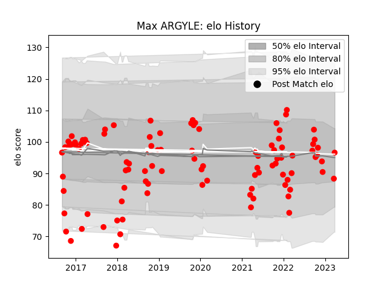

---  
layout: page  
title: Max ARGYLE  
date: 2023-03-29 11:29:09.167424  
categories: player  
---
# Max ARGYLE

Last updated: 2023-03-29
## Positions: FL, N8

## Current elo: 97.0

## Current Percentile: 35.0

# Elo History

# Match History

| Team   |   Appearances |   Win Rate |
|:-------|--------------:|-----------:|
| Jersey |            99 |   0.656566 |

| Opponent            |   Matches |   Win Rate |
|:--------------------|----------:|-----------:|
| Nottingham          |        10 |   0.85     |
| Cornish Pirates     |        10 |   0.8      |
| Richmond            |         9 |   0.888889 |
| Doncaster           |         9 |   0.444444 |
| Hartpury College    |         9 |   1        |
| London Scottish     |         8 |   0.625    |
| Bedford             |         8 |   0.625    |
| Ealing Trailfinders |         7 |   0        |
| Coventry            |         6 |   0.666667 |
| Ampthill            |         5 |   0.9      |
| Yorkshire Carnegie  |         5 |   0.6      |
| London Irish        |         4 |   0.5      |
| Rotherham Titans    |         3 |   0.666667 |
| Newcastle Falcons   |         2 |   0        |
| London Welsh        |         1 |   0        |
| Caldy               |         1 |   1        |
| Bristol Rugby       |         1 |   1        |
| Saracens            |         1 |   0        |