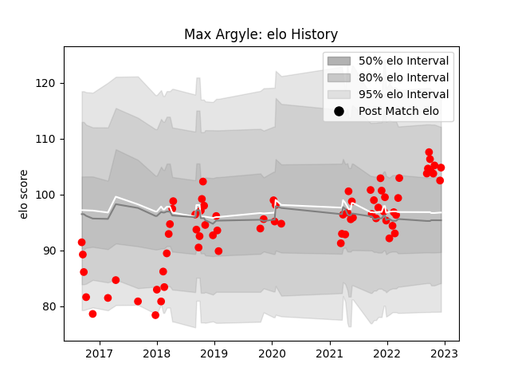

---  
layout: page  
title: Max Argyle  
date: 2022-12-18 16:31:11.458824  
categories: player  
---
# Max Argyle

## Positions: FL, N8

## Current elo: 105.0

## Current Percentile: 73.0

# Elo History

# Match History

| Team   |   Appearances |   Win Rate |
|:-------|--------------:|-----------:|
| Jersey |            72 |   0.645833 |

| Opponent            |   Matches |   Win Rate |
|:--------------------|----------:|-----------:|
| Nottingham          |         8 |   0.875    |
| Hartpury College    |         7 |   1        |
| Cornish Pirates     |         7 |   0.714286 |
| Bedford             |         7 |   0.714286 |
| London Scottish     |         6 |   0.666667 |
| Doncaster           |         6 |   0.333333 |
| Ealing Trailfinders |         6 |   0        |
| Richmond            |         5 |   0.8      |
| Coventry            |         5 |   0.6      |
| Yorkshire Carnegie  |         4 |   0.75     |
| Ampthill            |         3 |   0.833333 |
| London Irish        |         2 |   0.5      |
| Rotherham Titans    |         2 |   0.5      |
| Newcastle Falcons   |         1 |   0        |
| Caldy               |         1 |   1        |
| Bristol Rugby       |         1 |   1        |
| Saracens            |         1 |   0        |