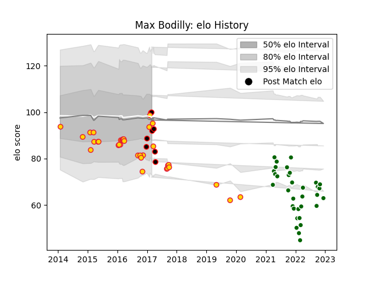

---  
layout: page  
title: Max Bodilly  
date: 2022-12-14 11:35:46.985149  
categories: player  
---
# Max Bodilly

## Positions: C, W

## Current elo: 88.0

## Current Percentile: 28.0

# Elo History

# Match History

| Team                |   Appearances |   Win Rate |
|:--------------------|--------------:|-----------:|
| Exeter Chiefs       |            34 |   0.573529 |
| Ealing Trailfinders |            33 |   0.848485 |
| Cornish Pirates     |             6 |   0.583333 |

| Opponent            |   Matches |   Win Rate |
|:--------------------|----------:|-----------:|
| Saracens            |         8 |   0.125    |
| Bedford             |         5 |   0.7      |
| Doncaster           |         5 |   0.6      |
| Hartpury College    |         4 |   1        |
| Richmond            |         4 |   0.75     |
| Nottingham          |         4 |   1        |
| Leicester Tigers    |         4 |   0.25     |
| Jersey              |         4 |   0.75     |
| Gloucester Rugby    |         3 |   0.5      |
| Harlequins          |         3 |   0.666667 |
| Ampthill            |         3 |   1        |
| Coventry            |         3 |   1        |
| Cornish Pirates     |         3 |   0.666667 |
| Ospreys             |         2 |   1        |
| Wasps               |         2 |   1        |
| Sale Sharks         |         2 |   0.5      |
| London Scottish     |         2 |   1        |
| Northampton Saints  |         2 |   1        |
| Ealing Trailfinders |         1 |   1        |
| Bordeaux Begles     |         1 |   0        |
| Bristol Rugby       |         1 |   1        |
| Newcastle Falcons   |         1 |   1        |
| Cardiff Blues       |         1 |   1        |
| Dragons             |         1 |   1        |
| London Irish        |         1 |   1        |
| Clermont Auvergne   |         1 |   0        |
| Bath Rugby          |         1 |   1        |
| Worcester Warriors  |         1 |   1        |