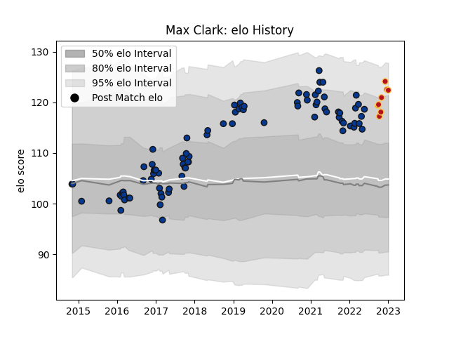

---  
layout: page  
title: Max Clark  
date: 2022-12-09 13:21:31.738130  
categories: player  
---
# Max Clark

## Positions: C

## Current elo: 118.0

## Current Percentile: 90.0

# Elo History

# Match History

| Team       |   Appearances |   Win Rate |
|:-----------|--------------:|-----------:|
| Bath Rugby |            85 |   0.470588 |
| Dragons    |             6 |   0.5      |

| Opponent           |   Matches |   Win Rate |
|:-------------------|----------:|-----------:|
| Wasps              |        10 |   0.3      |
| Northampton Saints |         8 |   0.5      |
| Gloucester Rugby   |         8 |   0.4375   |
| Exeter Chiefs      |         7 |   0.142857 |
| Harlequins         |         7 |   0.285714 |
| Newcastle Falcons  |         7 |   0.428571 |
| Bristol Rugby      |         7 |   0.428571 |
| Sale Sharks        |         6 |   0.416667 |
| Worcester Warriors |         5 |   1        |
| London Irish       |         5 |   0.8      |
| Saracens           |         5 |   0.6      |
| Leicester Tigers   |         4 |   0.5      |
| Benetton Treviso   |         2 |   0.5      |
| Cardiff Blues      |         2 |   0.5      |
| Ospreys            |         1 |   1        |
| Munster            |         1 |   1        |
| Scarlets           |         1 |   1        |
| Sharks             |         1 |   0        |
| Stade Toulousain   |         1 |   0        |
| Stormers           |         1 |   0        |
| London Welsh       |         1 |   1        |
| Zebre              |         1 |   1        |